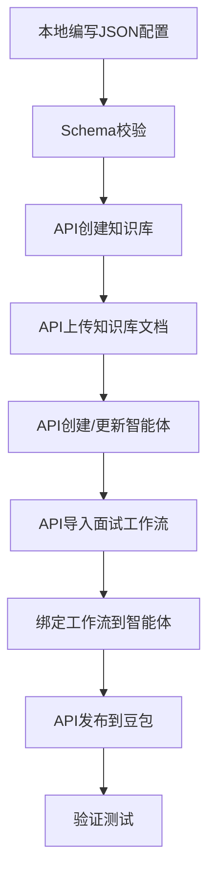

# WeHan C 端 - 求职助手

> 基于扣子智能体平台 + 豆包 App 的武汉高校毕业生求职助手

**架构**: 单 Agent + 技能路由 + 上下文隔离

---

## 目录结构

```
client/                        # C 端根目录
├── config/                     # 配置层
│   ├── settings.py             # 环境配置（PAT、Space ID、B端API）
│   ├── schema/                 # JSON Schema 校验文件
│   │   ├── bot_schema.json     # 智能体配置Schema
│   │   └── workflow_schema.json # 工作流配置Schema
│   └── local/                  # 本地配置文件（JSON格式）
│       ├── wehan_bot.json      # 智能体配置（单Bot+路由Prompt）
│       ├── interview_workflow.json # 面试工作流配置
│       └── knowledge_docs/     # 知识库文档
│           ├── jobs.pdf        # 岗位数据
│           └── policies.txt    # 政策数据
│
├── coze/                       # Coze平台能力封装
│   ├── admin.py                # 管理API（创建/更新/发布）
│   ├── agent.py                # 智能体对话（Chat v3）
│   ├── workflow.py             # 工作流执行
│   ├── voice.py                # 实时语音WebSocket
│   ├── file.py                 # 文件上传
│   └── knowledge.py            # 知识库管理
│
├── api/                        # B端API对接
│   ├── jobs.py                 # 岗位相关
│   ├── applications.py         # 投递相关
│   ├── interviews.py           # 面试报告相关
│   ├── resumes.py              # 简历相关
│   ├── policies.py             # 政策相关
│   └── conversations.py        # 会话管理
│
├── core/                       # 通用能力
│   ├── exceptions.py           # 自定义异常
│   ├── retry.py                # 重试机制
│   ├── logger.py               # 日志配置
│   └── schema_validate.py      # Schema校验工具
│
├── main/                       # 主流程入口
│   ├── main_upload.py          # 本地配置→API上传流程
│   └── main_interview.py       # 面试模拟主流程
│
├── requirements.txt            # 依赖清单
├── .env.example                # 环境变量模板
└── README.md                   # 本文档
```

---

## 快速开始

### 步骤 1：安装依赖

```bash
cd client
pip install -r requirements.txt
```

### 步骤 2：配置环境变量

```bash
cp .env.example .env
# 编辑 .env 文件，填入真实值
```

**必须配置的环境变量**：

| 变量 | 说明 | 获取方式 |
|-----|------|---------|
| `COZE_PAT` | 扣子个人访问令牌 | 扣子平台 → 设置 → 个人访问令牌 |
| `SPACE_ID` | 扣子空间 ID | 扣子空间 URL 中的 `w=` 参数 |
| `OPEN_API_KEY` | B 端 API 密钥 | B 端开发团队提供 |

### 步骤 3：编写本地配置

在 `config/local/` 目录下配置智能体和工作流：

- `wehan_bot.json` - 智能体 Prompt 和欢迎语
- `interview_workflow.json` - 面试工作流节点配置

### 步骤 4：执行上传流程

```bash
python main/main_upload.py
```

---

## 开发流程

### 本地开发 → API 上传



### 配置文件说明

#### 智能体配置 (`config/local/wehan_bot.json`)

```json
{
  "name": "WeHan 求职助手",
  "instructions": "# 角色：WeHan 求职&心理陪伴助手\n...",
  "welcome_message": "你好！我是 WeHan 求职助手 👋\n...",
  "visibility": "private"
}
```

#### 工作流配置 (`config/local/interview_workflow.json`)

```json
{
  "version": "1.0",
  "nodes": [...],
  "edges": [...],
  "input_parameters": [...],
  "output_parameters": [...]
}
```

---

## B 端 API 依赖

C 端开发需要 B 端提供以下 API 接口：

| API | 功能 | 状态 |
|-----|------|-----|
| `GET /api/open/jobs` | 获取岗位列表 | ✅ 已完成 |
| `GET /api/open/jobs/{id}` | 获取岗位详情 | ❌ 待开发 |
| `POST /api/open/interviews` | 保存面试报告 | ❌ 待开发 |
| `POST /api/open/resumes` | 保存简历 | ❌ 待开发 |
| `POST /api/open/conversations` | 保存会话 | ❌ 待开发 |

详细需求参见：`../docs/C端开发-B端协作需求.md`

---

## 技术架构

### 单 Agent + 技能路由

```
┌─────────────────────────────────────┐
│      WeHan 求职助手（单 Bot）        │
│      ┌──────────────────────┐       │
│      │ 【主 Bot】极简路由    │       │
│      └──────────┬───────────┘       │
│                 │                   │
│      ┌──────────┴────────┐          │
│      ▼                   ▼          │
│ ┌────────┐        ┌────────┐       │
│ │ 技能1：  │        │ 技能2：  │       │
│ │ AI面试  │        │心理疏导  │       │
│ │(工作流) │        │(子技能) │       │
│ └────────┘        └────────┘       │
└─────────────────────────────────────┘
```

### 上下文隔离

- 主 Bot 仅负责意图路由
- 各技能拥有独立 Prompt
- 工作流上下文完全隔离
- 面试中禁止切入心理疏导

---

## 常见问题

### Q1：如何获取 Coze PAT？

A：登录扣子平台 → 设置 → 个人访问令牌 → 创建新令牌

### Q2：Space ID 从哪里获取？

A：扣子空间 URL 中包含 `w=xxx` 参数，xxx 即为 Space ID

### Q3：如何测试智能体？

A：
1. 执行上传脚本后，登录扣子平台
2. 在预览面板测试对话功能
3. 确认无误后，发布到豆包

---

## 相关文档

| 文档 | 路径 | 说明 |
|-----|------|------|
| C 端技术框架 | `../docs/coze/coze技术参考文档.md` | 详细技术文档 |
| B 端协作需求 | `../docs/C端开发-B端协作需求.md` | API 接口需求 |
| 总体架构 | `../codemaps/architecture.md` | 系统架构图 |
| C 端技术框架 | `../codemaps/frontend-client.md` | 产品架构 |
| 产品需求 | `../PRD-武汉人才留汉智能服务平台.md` | PRD 文档 |

---

*更新时间: 2026-02-28*
