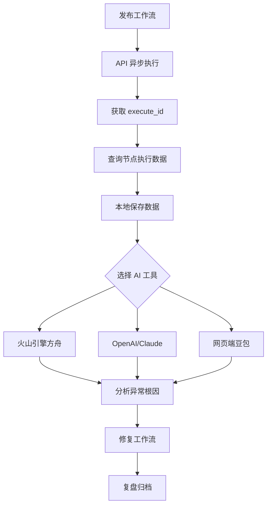

# Coze 工作流人机协同调试指南

> 本文档介绍如何通过 API 拉取工作流执行数据至本地，结合 AI 进行深度分析，实现高效调试闭环。

---

## 一、核心概念 ⚠️ 必读

### 1.1 execute_id 的唯一来源

> ⚠️ **极其重要**：`execute_id` **只能通过 API 异步执行获取**，网页端手动调试不会返回该 ID！

| 执行方式 | 是否返回 execute_id | 说明 |
|---------|-------------------|------|
| **API 异步执行** (`is_async=true`) | ✅ 返回 | **唯一合法来源** |
| API 同步执行 (`is_async=false`) | ❌ 不返回 | 仅返回最终输出 |
| API 流式执行 (`stream=true`) | ❌ 不返回 | 返回事件流 |
| 网页端手动调试 | ❌ 不返回 | 平台内部测试，不接入 API 体系 |

### 1.2 为什么网页端调试没有 execute_id？

Coze 的设计逻辑是「场景分离」：
- **网页端手动调试**：面向「可视化验证流程」，给开发者直观查看节点是否通顺，无需生成 API 可查询的标识
- **API 异步执行**：面向「程序化调试/生产调用」，需要 `execute_id` 关联执行请求和结果，支持批量分析、本地归档等需求

### 1.3 整体流程图



---

## 二、前期准备

### 2.1 权限与核心信息获取

#### Access Token（访问令牌）

- **用途**：API 调用的身份认证
- **必要权限**：
  - `workflow:run` - 执行工作流
  - `workflow:read` - 读取工作流信息
  - `listRunHistory` - 查询执行历史（**核心权限**）
- **获取路径**：Coze 平台 → 个人设置 → 访问令牌 → 新建令牌 → 勾选权限 → 生成并保存
- **注意**：令牌仅显示一次，务必留存

#### 核心ID信息

| ID 类型 | 说明 | 获取方式 |
|--------|------|---------|
| `workflow_id` | 工作流ID | 工作流编排页 URL 中 `workflow` 参数后的字符串 |
| `app_id` | 应用ID（可选） | 应用业务编排页 URL 中 `project-id` 参数后的字符串 |

**URL 解析示例**：
```
# 工作流 URL
https://www.coze.cn/work_flow?workflow=7462xxx&space_id=7491xxx
                                       ↑ workflow_id
```

#### 数据有效期

| 数据类型 | 保留时长 |
|---------|---------|
| 输出节点数据 | **24 小时** |
| 结束节点数据 | **7 天** |

> **建议**：重要记录在执行后 **24 小时内** 拉取归档

### 2.2 本地环境准备

#### Python 版本要求

| 版本 | 推荐度 | 说明 |
|-----|-------|------|
| Python 3.9-3.11 | ✅ 推荐 | 完全兼容，无已知问题 |
| Python 3.8 | ⚠️ 可用 | 部分 JSON 解析场景存在兼容问题 |
| Python 3.12+ | ⚠️ 谨慎 | 需确认 requests 库适配性 |

#### 依赖安装

```bash
# 推荐方案：指定版本 + 国内镜像源
pip install -i https://pypi.tuna.tsinghua.edu.cn/simple \
    requests==2.31.0 \
    json5==0.9.14 \
    openai==1.30.1
```

---

## 三、核心实操流程

### 3.1 第一步：发布工作流（必填前提）

> ⚠️ **重要**：只有**已发布**的工作流才能通过 API 调用！

1. 打开 Coze 工作流编排页
2. 确认节点配置无误
3. 点击右上角「发布」按钮
4. 记录 `workflow_id`（从 URL 中提取）

### 3.2 第二步：API 异步执行，获取 execute_id

> 这是获取 `execute_id` 的**唯一途径**

#### API 调用说明

| 项目 | 说明 |
|-----|------|
| 请求方式 | POST |
| API 地址 | `https://api.coze.cn/v1/workflow/run` |
| 认证方式 | Bearer Token（Header: `Authorization: Bearer {access_token}`） |
| 关键参数 | `is_async: true`（**必须设为 true**） |

#### curl 命令（快速测试）

```bash
curl --location --request POST 'https://api.coze.cn/v1/workflow/run' \
--header 'Authorization: Bearer 你的Access Token' \
--header 'Content-Type: application/json' \
--data-raw '{
  "workflow_id": "已发布的工作流ID",
  "app_id": "你的应用ID",
  "is_async": true,
  "parameters": {
    "input_param_1": "测试值1",
    "input_param_2": "测试值2"
  }
}'
```

#### 响应示例

```json
{
  "code": 0,
  "msg": "Success",
  "execute_id": "exec_743104097880585****",  // 核心：用于后续查询
  "debug_url": "https://www.coze.cn/work_flow?execute_id=xxx&space_id=xxx",
  "data": ""
}
```

> **注意**：异步执行时 `data` 为空，需要用 `execute_id` 查询结果

#### Python 代码

```python
import requests
import json
import os

# 从环境变量读取敏感信息
CONFIG = {
    "access_token": os.getenv("COZE_ACCESS_TOKEN", "pat_你的Token"),
    "workflow_id": os.getenv("COZE_WORKFLOW_ID", "你的工作流ID"),
    "app_id": os.getenv("COZE_APP_ID", "你的应用ID"),
    "base_url": "https://api.coze.cn/v1"
}


def execute_workflow_async(parameters: dict) -> str | None:
    """
    异步执行工作流，返回 execute_id

    Args:
        parameters: 工作流入参字典

    Returns:
        execute_id，失败返回 None
    """
    url = f"{CONFIG['base_url']}/workflow/run"
    headers = {
        "Authorization": f"Bearer {CONFIG['access_token']}",
        "Content-Type": "application/json"
    }
    data = {
        "workflow_id": CONFIG["workflow_id"],
        "app_id": CONFIG["app_id"],
        "is_async": True,  # 必须为 true
        "parameters": parameters
    }

    try:
        response = requests.post(url, headers=headers, json=data, timeout=30)
        response.raise_for_status()
        result = response.json()

        if result.get("code") != 0:
            print(f"❌ 执行失败：{result.get('msg')}")
            return None

        execute_id = result.get("execute_id")
        debug_url = result.get("debug_url")
        print(f"✅ 异步执行成功！")
        print(f"   execute_id: {execute_id}")
        print(f"   debug_url: {debug_url}")
        return execute_id

    except Exception as e:
        print(f"❌ 请求失败：{str(e)}")
        return None


# 使用示例
if __name__ == "__main__":
    # 工作流入参
    params = {
        "job_title": "前端工程师",
        "jd_content": "负责公司前端开发..."
    }

    execute_id = execute_workflow_async(params)
```

### 3.3 第三步：查询节点执行数据

拿到 `execute_id` 后，调用「查询工作流异步运行结果 API」获取全量节点数据。

#### API 调用说明

| 项目 | 说明 |
|-----|------|
| 请求方式 | GET |
| API 地址 | `https://api.coze.cn/v1/workflows/{workflow_id}/run_histories/{execute_id}` |
| 认证方式 | Bearer Token |

#### curl 命令

```bash
curl --location --request GET \
  'https://api.coze.cn/v1/workflows/你的workflow_id/run_histories/你的execute_id' \
  --header 'Authorization: Bearer 你的access_token'
```

#### 模块化 Python 代码

```python
import requests
import json
import os
from requests.adapters import HTTPAdapter
from urllib3.util.retry import Retry

# -------------------------- 从环境变量读取敏感信息 --------------------------
CONFIG = {
    "access_token": os.getenv("COZE_ACCESS_TOKEN", "pat_你的Token"),
    "workflow_id": os.getenv("COZE_WORKFLOW_ID", "你的工作流ID"),
    "app_id": os.getenv("COZE_APP_ID", "你的应用ID"),
    "base_url": "https://api.coze.cn/v1",
    "save_path": "./coze_workflow_debug_data"
}
# --------------------------------------------------------------------------


class CozeWorkflowDebugger:
    """Coze 工作流调试器 - 封装异步执行、数据拉取、保存逻辑"""

    def __init__(self, access_token: str, workflow_id: str, app_id: str = "", save_path: str = "./debug_data"):
        self.access_token = access_token
        self.workflow_id = workflow_id
        self.app_id = app_id
        self.save_path = save_path
        self.base_url = "https://api.coze.cn/v1"
        self.session = self._create_retry_session()
        os.makedirs(self.save_path, exist_ok=True)

    def _create_retry_session(self) -> requests.Session:
        """创建带重试机制的 Session"""
        session = requests.Session()
        retry = Retry(
            total=3,
            backoff_factor=1,
            status_forcelist=[500, 502, 503, 504]
        )
        adapter = HTTPAdapter(max_retries=retry)
        session.mount("https://", adapter)
        return session

    def execute_async(self, parameters: dict) -> str | None:
        """
        异步执行工作流，返回 execute_id

        Args:
            parameters: 工作流入参

        Returns:
            execute_id，失败返回 None
        """
        url = f"{self.base_url}/workflow/run"
        headers = {
            "Authorization": f"Bearer {self.access_token}",
            "Content-Type": "application/json"
        }
        data = {
            "workflow_id": self.workflow_id,
            "app_id": self.app_id,
            "is_async": True,
            "parameters": parameters
        }

        try:
            response = self.session.post(url, headers=headers, json=data, timeout=30)
            response.raise_for_status()
            result = response.json()

            if result.get("code") != 0:
                print(f"❌ 执行失败：{result.get('msg')}")
                return None

            execute_id = result.get("execute_id")
            print(f"✅ 异步执行成功！execute_id: {execute_id}")
            return execute_id

        except Exception as e:
            print(f"❌ 执行失败：{str(e)}")
            return None

    def pull_node_data(self, execute_id: str) -> list | None:
        """
        拉取节点执行数据

        Args:
            execute_id: 执行 ID

        Returns:
            节点数据列表，失败返回 None
        """
        api_url = f"{self.base_url}/workflows/{self.workflow_id}/run_histories/{execute_id}"
        headers = {
            "Authorization": f"Bearer {self.access_token}",
            "Content-Type": "application/json"
        }

        try:
            response = self.session.get(api_url, headers=headers, timeout=10)
            response.raise_for_status()
            data = response.json()

            if data.get("code") != 0:
                print(f"❌ API 返回错误：{data.get('msg')}")
                return None

            nodes = data["data"]["nodes"]
            print(f"✅ 拉取成功！共 {len(nodes)} 个节点")

            self._save_data(nodes, execute_id)
            return nodes

        except requests.exceptions.Timeout:
            print("❌ 请求超时，请检查网络或稍后重试")
            return None
        except requests.exceptions.HTTPError as e:
            print(f"❌ HTTP 错误：{e.response.status_code}")
            return None
        except Exception as e:
            print(f"❌ 拉取失败：{str(e)}")
            return None

    def execute_and_pull(self, parameters: dict) -> list | None:
        """
        一键执行并拉取数据（推荐）

        Args:
            parameters: 工作流入参

        Returns:
            节点数据列表
        """
        execute_id = self.execute_async(parameters)
        if not execute_id:
            return None

        print("⏳ 等待工作流执行完成...")
        import time
        time.sleep(3)  # 等待执行完成

        return self.pull_node_data(execute_id)

    def batch_pull_data(self, execute_id_list: list) -> dict:
        """批量拉取多个 execute_id 的数据"""
        all_data = {}
        for idx, execute_id in enumerate(execute_id_list, 1):
            print(f"\n[{idx}/{len(execute_id_list)}] 正在拉取 {execute_id}...")
            data = self.pull_node_data(execute_id)
            if data:
                all_data[execute_id] = data
        return all_data

    def _save_data(self, data: list, execute_id: str):
        """保存数据到本地 JSON 文件"""
        file_path = f"{self.save_path}/execute_{execute_id}_nodes.json"
        with open(file_path, "w", encoding="utf-8") as f:
            json.dump(data, f, ensure_ascii=False, indent=4)
        print(f"📁 已保存至：{file_path}")


# -------------------------- 使用示例 --------------------------
if __name__ == "__main__":
    debugger = CozeWorkflowDebugger(
        access_token=CONFIG["access_token"],
        workflow_id=CONFIG["workflow_id"],
        app_id=CONFIG["app_id"],
        save_path=CONFIG["save_path"]
    )

    # 方式一：一键执行并拉取（推荐）
    params = {
        "job_title": "前端工程师",
        "jd_content": "负责公司前端开发..."
    }
    nodes = debugger.execute_and_pull(params)

    # 方式二：分步操作
    # execute_id = debugger.execute_async(params)
    # nodes = debugger.pull_node_data(execute_id)

    # 预览节点
    if nodes:
        print("\n📌 前 3 个节点预览：")
        for i, node in enumerate(nodes[:3], 1):
            print(f"\n节点{i}：{node.get('node_name')}（{node.get('node_type')}）")
            print(f"  状态：{node.get('status')}")
            if node.get('error'):
                print(f"  错误：{node.get('error')}")
```

#### 数据结构说明

| 字段名 | 说明 | 调试价值 |
|-------|------|---------|
| `node_name` | 节点名称 | 快速定位异常节点 |
| `node_type` | 节点类型 | 判断节点功能 |
| `status` | 执行状态（Success/Failed/Timeout/Running） | 筛选异常节点 |
| `input` | 节点输入数据 | 排查参数传递错误 |
| `output` | 节点输出数据 | 对比预期输出 |
| `error` | 执行错误信息 | 直接定位根因 |
| `start_time/end_time` | 开始/结束时间 | 分析节点耗时 |

### 3.4 第四步：本地 AI 分析

**目的**：利用 AI 快速处理节点数据，实现异常节点筛选、根因定位、数据对比、优化建议。

#### 数据脱敏（重要）

```python
import re

def desensitize_data(data: dict) -> dict:
    """脱敏处理：替换手机号、身份证号、密钥等"""
    text = json.dumps(data, ensure_ascii=False)

    text = re.sub(r'1[3-9]\d{9}', '1**********', text)           # 手机号
    text = re.sub(r'\d{17}[\dXx]', '******************', text)   # 身份证
    text = re.sub(r'pat_[a-zA-Z0-9]+', 'pat_***', text)          # Coze Token
    text = re.sub(r'sk-[a-zA-Z0-9]+', 'sk-***', text)            # OpenAI Key

    return json.loads(text)
```

#### 优化后的提示词模板

```
你是 Coze 工作流调试专家，严格按以下步骤分析：

1. 异常节点筛选：仅列出 status 为 Failed/Timeout 的节点，格式为「节点名称 | 节点类型 | 错误信息」

2. 根因分析：针对每个异常节点，回答 3 个问题：
   ① 输入参数是否缺失/格式错误？
   ② 节点依赖的资源（如函数/LLM）是否异常？
   ③ 节点逻辑是否冲突？

3. 解决方案：每个根因对应 1-2 个可落地的修复步骤

4. 优化建议：仅针对本次执行的瓶颈（如耗时超 5s 的节点）给出建议

节点数据：{node_data}
```

#### AI 分析代码示例

**火山引擎方舟（字节豆包）**：
```python
def analyze_with_volcengine(node_data: list, api_key: str, model: str) -> str:
    url = "https://ark.cn-beijing.volces.com/api/v3/chat/completions"
    prompt = f"你是 Coze 工作流调试专家...\n\n节点数据：{json.dumps(node_data, ensure_ascii=False)}"

    headers = {
        "Content-Type": "application/json",
        "Authorization": f"Bearer {api_key}"
    }
    data = {
        "model": model,
        "messages": [{"role": "user", "content": prompt}],
        "temperature": 0.3
    }

    response = requests.post(url, headers=headers, json=data, timeout=60)
    return response.json()["choices"][0]["message"]["content"]
```

**OpenAI**：
```python
from openai import OpenAI

def analyze_with_openai(node_data: list, api_key: str) -> str:
    client = OpenAI(api_key=api_key)
    prompt = f"你是 Coze 工作流调试专家...\n\n节点数据：{json.dumps(node_data, ensure_ascii=False)}"

    response = client.chat.completions.create(
        model="gpt-4o",
        messages=[{"role": "user", "content": prompt}],
        temperature=0.3
    )
    return response.choices[0].message.content
```

**网页端豆包（零代码）**：
1. 将节点数据 JSON 保存为文件
2. 打开 [豆包网页版](https://www.doubao.com)
3. 上传 JSON 文件或粘贴数据
4. 输入分析提示词
5. 获取分析结果

---

## 四、常见问题排查

### 4.1 找不到 execute_id

| 问题 | 原因 | 解决方案 |
|-----|------|---------|
| 网页端调试记录里没有 execute_id | 网页端调试不返回该 ID | **必须通过 API 异步执行** |
| API 同步执行没有 execute_id | `is_async` 未设为 `true` | 设置 `is_async: true` |
| 流式执行没有 execute_id | 流式模式不返回该 ID | 改用异步模式 |

### 4.2 API 调用失败

| 错误码 | 原因 | 解决方案 |
|-------|------|---------|
| **400 Bad Request** | 参数错误/工作流未发布 | 检查参数格式，确认工作流已发布 |
| **401 Unauthorized** | Token 无效或过期 | 重新生成令牌 |
| **403 Forbidden** | 权限不足 | 确保 Token 勾选 `listRunHistory`、`workflow:run`、`workflow:read` |
| **404 Not Found** | workflow_id 或 execute_id 错误 | 核对 ID 是否正确 |
| **429 Too Many Requests** | 请求频率超限 | 降低请求频率 |

### 4.3 数据查询失败

| 问题 | 原因 | 解决方案 |
|-----|------|---------|
| 查询返回空数据 | 执行记录已过期 | 输出节点数据 24 小时过期，及时拉取 |
| 节点数据不完整 | 工作流仍在执行中 | 等待执行完成后再查询 |

---

## 五、完整工作流示例

### 一键调试脚本

```python
#!/usr/bin/env python3
"""
Coze 工作流一键调试脚本
用法：python debug_workflow.py
"""

import os
import json
import requests

# 配置
CONFIG = {
    "access_token": os.getenv("COZE_ACCESS_TOKEN"),
    "workflow_id": os.getenv("COZE_WORKFLOW_ID"),
    "app_id": os.getenv("COZE_APP_ID", ""),
    "ai_api_key": os.getenv("VOLC_API_KEY"),  # 火山引擎 API Key
    "ai_model": os.getenv("VOLC_MODEL_ID"),   # 推理接入点 ID
}

def main():
    from coze_debugger import CozeWorkflowDebugger

    debugger = CozeWorkflowDebugger(
        access_token=CONFIG["access_token"],
        workflow_id=CONFIG["workflow_id"],
        app_id=CONFIG["app_id"]
    )

    # 1. 执行并拉取数据
    params = {"job_title": "前端工程师"}
    nodes = debugger.execute_and_pull(params)

    if not nodes:
        print("❌ 调试失败")
        return

    # 2. AI 分析
    if CONFIG["ai_api_key"]:
        from coze_debugger import analyze_with_volcengine
        result = analyze_with_volcengine(
            nodes,
            CONFIG["ai_api_key"],
            CONFIG["ai_model"]
        )
        print("\n" + "="*60)
        print("📊 AI 分析结果：")
        print("="*60)
        print(result)

    print("\n✅ 调试完成！")

if __name__ == "__main__":
    main()
```

---

## 六、核心总结

| 要点 | 说明 |
|-----|------|
| **execute_id 唯一来源** | 必须通过 API 异步执行（`is_async=true`），无其他途径 |
| **工作流必须发布** | 未发布的工作流无法通过 API 调用 |
| **必要权限** | Token 必须开通 `listRunHistory`、`workflow:run`、`workflow:read` |
| **数据有效期** | 输出节点 24 小时，结束节点 7 天 |
| **推荐流程** | API 异步执行 → 获取 execute_id → 查询节点数据 → AI 分析 |

---

## 七、附录

### 官方文档

| 资源 | 链接 |
|-----|------|
| Coze API 文档 | https://www.coze.cn/docs/api/introduction |
| 执行工作流 API | https://www.coze.cn/docs/developer_guides/workflow_run |
| 查询执行历史 API | https://www.coze.cn/docs/developer_guides/workflow_history |
| 火山引擎方舟 | https://www.volcengine.com/docs/82379 |

### 环境变量设置

```bash
# Windows
set COZE_ACCESS_TOKEN=pat_xxx
set COZE_WORKFLOW_ID=7462xxx
set VOLC_API_KEY=你的火山引擎Key
set VOLC_MODEL_ID=ep-xxx

# macOS/Linux
export COZE_ACCESS_TOKEN=pat_xxx
export COZE_WORKFLOW_ID=7462xxx
export VOLC_API_KEY=你的火山引擎Key
export VOLC_MODEL_ID=ep-xxx
```

---

> **声明**：本文档以 [Coze 官方最新文档](https://www.coze.cn/docs/api/introduction) 为准。平台迭代可能导致部分信息失效，遇问题时请优先核对官方文档。
