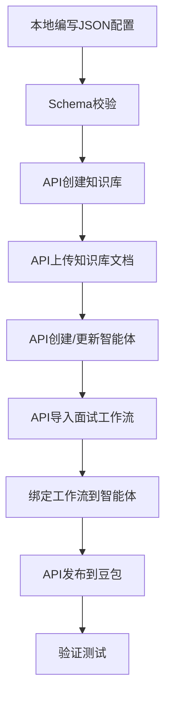

你希望我基于《WeHan C 端 Coze 开发任务清单》输出一套**可直接落地开发的完整代码骨架**，仅搭建核心结构（流程、异常、入口），不涉及具体业务逻辑和B端API实现，你只需填充配置和B端接口细节就能直接开发，这个需求我完全理解。

下面是为你梳理的**全套可直接复用的代码框架**，包含目录结构、核心文件代码、全量易踩坑点，你复制到本地即可开始开发。

---

# WeHan C 端 Coze 技术框架

> 基于「单 Agent + 技能路由 + 上下文隔离」架构，支持本地开发 + API 上传完整流程

**更新时间**: 2026-02-28 (v2.1 - 修正官方 API 端点)

---

## ⚠️ API 端点重要更新（基于豆包官方解答）

### 修正的 API 端点

| 功能 | ~~错误端点~~ | **正确端点** | 变更说明 |
|-----|------------|-------------|---------|
| 创建智能体 | `POST /v1/bot/create` | `POST /v1/bot` | 直接使用 `/bot` 创建 |
| 更新智能体 | `POST /v1/bot/update` | `PATCH /v1/bot/{bot_id}` | 使用 PATCH 方法 |
| 发布智能体 | `POST /v1/bot/publish` | `POST /v1/bot/publish` | ✅ 保持不变 |
| 创建/导入工作流 | `POST /v1/workflow/import` | `POST /v1/workflow` | 统一使用 `/workflow` |
| 更新工作流 | ~~无~~ | `PATCH /v1/workflow/{workflow_id}` | 新增端点 |
| 创建知识库 | `POST /v1/knowledge/create` | `POST /v1/knowledge_base` | 使用 `knowledge_base` |
| 上传文档 | `POST /v1/knowledge/document/upload` | `POST /v1/knowledge_base/{id}/document` | 路径包含知识库 ID |
| 绑定知识库 | ~~通过 bot.update~~ | `POST /v1/bot/{bot_id}/knowledge_base/bind` | 独立绑定端点 |
| 绑定工作流 | ~~通过 bot.update~~ | `POST /v1/bot/{bot_id}/workflow/bind` | 独立绑定端点 |

### 404 错误根因分析

| 错误原因 | 具体表现 | 解决方案 |
|---------|---------|---------|
| **端点名称错误** | `/workflow/import` 和 `/workflow/create` 均返回 404 | 使用 `/workflow` 创建/导入工作流 |
| **资源名称错误** | `/knowledge` 返回 404 | 使用 `/knowledge_base`（带下划线） |
| **HTTP 方法错误** | POST 更新可能失败 | 更新操作使用 PATCH 方法 |
| **请求格式错误** | space_id 在 URL 参数中不生效 | space_id 必须在请求体中 |

### 官方验证的 API 端点（2026-02-28）

```bash
# 1. 验证 PAT 和 Space ID 有效性
GET https://api.coze.cn/v1/space/list
Authorization: Bearer {PAT}

# 2. 创建智能体
POST https://api.coze.cn/v1/bot
Content-Type: application/json
{
  "space_id": "{SPACE_ID}",
  "name": "WeHan 求职助手",
  "prompt": {
    "system_prompt": "你是求职助手..."
  }
}

# 3. 创建知识库
POST https://api.coze.cn/v1/knowledge_base
Content-Type: application/json
{
  "space_id": "{SPACE_ID}",
  "name": "WeHan 求职知识库",
  "type": "document"
}

# 4. 上传文档到知识库
POST https://api.coze.cn/v1/knowledge_base/{knowledge_base_id}/document
Content-Type: multipart/form-data
file=@jobs.csv

# 5. 创建/导入工作流
POST https://api.coze.cn/v1/workflow
Content-Type: application/json
{
  "space_id": "{SPACE_ID}",
  "name": "面试模拟工作流",
  "description": "...",
  "nodes": [...],
  "edges": [...]
}

# 6. 绑定知识库到智能体
POST https://api.coze.cn/v1/bot/{bot_id}/knowledge_base/bind
Content-Type: application/json
{
  "space_id": "{SPACE_ID}",
  "knowledge_base_id": "{knowledge_base_id}",
  "weight": 1.0
}

# 7. 绑定工作流到智能体
POST https://api.coze.cn/v1/bot/{bot_id}/workflow/bind
Content-Type: application/json
{
  "space_id": "{SPACE_ID}",
  "workflow_id": "{workflow_id}",
  "trigger_type": "manual"
}
```

### SDK 使用（推荐）

豆包官方提供了 Python 和 JavaScript SDK，可以避免端点记忆问题：

```bash
# 安装 Python SDK
pip install coze-sdk
```

```python
from coze import Coze, CozeConfig

# 初始化
config = CozeConfig(
    api_key=PAT,
    base_url="https://api.coze.cn/v1"  # 中国区
)
coze = Coze(config)

# 创建智能体（SDK 自动处理端点）
bot = coze.bot.create(
    space_id=SPACE_ID,
    name="WeHan 求职助手",
    prompt={"system_prompt": "..."}
)
```

---

# 一、项目完整目录结构

```
wehan_coze/
├── config/                      # 配置层
│   ├── settings.py              # 环境配置（PAT、Space ID、B端API）
│   ├── schema/                  # JSON Schema 校验文件
│   │   ├── bot_schema.json      # 智能体配置Schema
│   │   └── workflow_schema.json # 工作流配置Schema
│   └── local/                   # 本地配置文件（JSON格式）
│       ├── wehan_bot.json       # 智能体配置（单Bot+路由Prompt）
│       ├── interview_workflow.json  # 面试工作流配置
│       └── knowledge_docs/      # 知识库文档
│           ├── jobs.pdf         # 岗位数据
│           └── policies.txt     # 政策数据
│
├── coze/                        # Coze平台能力封装
│   ├── admin.py                 # 管理API（创建/更新/发布）
│   ├── agent.py                 # 智能体对话（Chat v3）
│   ├── workflow.py              # 工作流执行
│   ├── voice.py                 # 实时语音WebSocket
│   ├── file.py                  # 文件上传
│   └── knowledge.py             # 知识库管理
│
├── api/                         # B端API对接
│   ├── jobs.py                  # 岗位相关
│   ├── applications.py          # 投递相关
│   ├── interviews.py            # 面试报告相关
│   ├── resumes.py               # 简历相关
│   └── policies.py              # 政策相关
│
├── core/                        # 通用能力
│   ├── exceptions.py            # 自定义异常
│   ├── retry.py                 # 重试机制
│   ├── logger.py                # 日志配置
│   └── schema_validate.py       # Schema校验工具
│
├── main/                        # 主流程入口
│   ├── main_upload.py           # 本地配置→API上传流程
│   └── main_interview.py        # 面试模拟主流程
│
└── requirements.txt             # 依赖清单
```

---

# 二、核心架构设计：单 Agent + 技能路由

## 2.1 架构图

```
┌─────────────────────────────────────────────────────────────────┐
│                    WeHan 求职助手（单 Bot）                      │
├─────────────────────────────────────────────────────────────────┤
│                                                                 │
│  ┌───────────────────────────────────────────────────────────┐  │
│  │  【主 Bot】极简路由 Prompt（本地JSON配置）                 │  │
│  │  ├── 意图识别：面试 vs 心理疏导                            │  │
│  │  ├── 路由规则：                                            │  │
│  │  │   "面试/刷题/岗位/简历" → 触发面试工作流                │  │
│  │  │   "焦虑/难受/压力大/心情不好" → 触发心理疏导            │  │
│  │  └── 路由分发：不回答具体内容                              │  │
│  └───────────────────────────────────────────────────────────┘  │
│                            │                                   │
│         ┌──────────────────┴──────────────────┐                │
│         ▼                                     ▼                │
│  ┌─────────────────────┐         ┌─────────────────────┐      │
│  │ 【技能1：AI 面试】   │         │ 【技能2：心理疏导】  │      │
│  │ 独立工作流（上下文隔离）│       │ 触发式子技能        │      │
│  │                     │         │                     │      │
│  │ - 独立 Prompt        │         │ - 触发式加载         │      │
│  │ - 固定流程：         │         │ - 面试中禁止切入     │      │
│  │   JD→出题→对话→评分  │         │ - 不干扰主流程       │      │
│  │ - 输出被JSON锁死     │         │ - 温和共情           │      │
│  │ - 不可能幻觉         │         │                     │      │
│  └─────────────────────┘         └─────────────────────┘      │
│                                                                 │
└─────────────────────────────────────────────────────────────────┘
```

## 2.2 为什么单 Agent 优于双 Agent？

| 对比项 | 双 Agent（求职+心理分开） | 单 Agent + 技能路由 |
|-------|-------------------------|-------------------|
| 用户体验 | 需要切换入口 | 一个入口完成所有功能 |
| 上下文连贯 | 两个独立上下文 | 面试后可直接安慰 |
| 维护成本 | 需要维护两套Prompt | 统一维护 |
| 发布次数 | 需要发布两次 | 只需发布一次 |
| 精度控制 | 各自独立，但体验割裂 | 上下文隔离，精度不减 |

## 2.3 本地开发 → API 上传流程



---

# 三、核心配置文件

## 3.1 config/settings.py（环境配置）

```python
"""
配置文件：所有敏感信息/固定参数都在这里配置
你只需替换占位符为真实值，其他无需修改
"""

# ===================== Coze 基础配置 =====================
# 个人访问令牌（PAT）- 从扣子平台获取
COZE_PAT = "pat_xxxxxxxxxxxxxxxx"

# 空间 ID - 从扣子空间 URL 中获取（w=xxx）
SPACE_ID = "your_space_id_here"

# 智能体ID（创建后自动生成，首次可留空）
BOT_ID = ""  # WeHan 求职助手（单Bot）

# 工作流ID（创建后自动生成，首次可留空）
WORKFLOW_ID_INTERVIEW = ""  # 面试模拟工作流

# 知识库ID（创建后自动生成，首次可留空）
KNOWLEDGE_ID = ""  # 岗位知识库

# 实时语音配置
CONNECTOR_ID = "1024"
VOICE_ID = "7426720361733046281"  # 精品音色
AUDIO_FORMAT = "pcm"
AUDIO_SAMPLE_RATE = 24000
AUDIO_CHANNEL = 1
VAD_SILENCE_THRESHOLD_MS = 300

# ===================== B端API配置 =====================
B_API_BASE_URL = "https://your-b-domain.com/api/open"
B_API_KEY = "OPEN_API_KEY"
B_API_TIMEOUT = 30

# ===================== 通用配置 =====================
MAX_RETRY_TIMES = 3
RETRY_DELAY = 1
COZE_API_TIMEOUT = 30
COZE_WORKFLOW_TIMEOUT = 120
LOG_LEVEL = "INFO"
LOG_FILE = "wehan_coze.log"
```

## 3.2 config/local/wehan_bot.json（智能体本地配置）

```json
{
  "name": "WeHan 求职助手",
  "description": "武汉高校毕业生一站式求职助手（AI面试+心理陪伴）",
  "avatar": "",
  "instructions": "# 角色：WeHan 求职&心理陪伴助手\n\n你是为武汉高校毕业生服务的一站式求职助手，同时具备情绪支持能力。\n\n## 你有两大核心技能，会自动识别用户需求：\n\n【技能1：求职服务（核心）】\n- AI模拟面试：根据岗位JD出题、语音对话、生成评估报告\n- 简历解析、岗位匹配、一键投递\n- 只推荐武汉地区岗位\n\n【技能2：心理疏导与情绪陪伴】\n- 倾听求职压力、焦虑、迷茫、挫败等情绪\n- 温柔共情、给予鼓励和疏导\n- 不做医疗诊断，只做陪伴式安慰\n\n## 你的行为规则\n1. 用户如果说：面试、刷题、岗位、简历、投递 → 触发「求职工作流」\n2. 用户如果说：焦虑、难受、压力大、心情不好 → 进入「情绪疏导模式」\n3. 不强行推荐功能，用户问什么就答什么\n4. 面试流程进行中，专注于面试，不切入心理疏导\n5. 语气统一：专业、温暖、可靠",
  "welcome_message": "你好！我是 WeHan 求职助手 👋\n\n我可以帮你：\n- 🎤 AI 模拟面试 - 实战练习，提升面试能力\n- 📄 简历解析 - 智能分析，生成人才画像\n- 🔍 岗位匹配 - 精准推荐，找到心仪工作\n- 💚 心理支持 - 缓解焦虑，陪伴求职路\n\n你想做什么？",
  "visibility": "private"
}
```

## 3.3 config/local/interview_workflow.json（面试工作流配置）

```json
{
  "version": "1.0",
  "name": "WeHan 面试模拟工作流",
  "description": "从岗位JD生成面试题 → 语音对话 → 生成评估报告",
  "nodes": [
    {
      "id": "start",
      "type": "start",
      "config": {
        "parameters": [
          { "name": "job_id", "type": "string", "required": true, "description": "岗位ID" },
          { "name": "user_id", "type": "string", "required": true, "description": "用户ID" }
        ]
      }
    },
    {
      "id": "get_job_detail",
      "type": "http",
      "config": {
        "url": "${B_API_BASE_URL}/jobs/${job_id}",
        "method": "GET",
        "headers": {
          "Authorization": "Bearer ${B_API_KEY}"
        }
      }
    },
    {
      "id": "generate_questions",
      "type": "llm",
      "config": {
        "prompt": "你是专业的面试官。根据以下岗位JD，生成10-20道面试题：\n\n岗位信息：\n${get_job_detail.body}\n\n要求：\n1. 题目难度适中\n2. 涵盖专业知识、项目经验、软技能\n3. 输出JSON格式：{\"questions\": [{\"id\": 1, \"question\": \"题目内容\", \"category\": \"专业知识\"}]}"
      }
    },
    {
      "id": "voice_interview",
      "type": "interaction",
      "config": {
        "connector_id": "${CONNECTOR_ID}",
        "voice_id": "${VOICE_ID}",
        "input_audio": {
          "format": "pcm",
          "sample_rate": 24000,
          "channel": 1
        },
        "turn_detection": {
          "type": "semantic_vad",
          "semantic_vad_config": {
            "silence_threshold_ms": 300
          }
        }
      }
    },
    {
      "id": "generate_report",
      "type": "llm",
      "config": {
        "prompt": "你是专业的面试评估官。根据以下面试记录，生成评估报告：\n\n面试题目：${generate_questions.body}\n\n用户回答：${voice_interview.answers}\n\n输出JSON格式：\n{\n  \"totalScore\": 85,\n  \"dimensions\": [\n    {\"name\": \"专业知识\", \"score\": 90, \"maxScore\": 100},\n    {\"name\": \"表达能力\", \"score\": 80, \"maxScore\": 100},\n    {\"name\": \"逻辑思维\", \"score\": 85, \"maxScore\": 100},\n    {\"name\": \"应变能力\", \"score\": 82, \"maxScore\": 100}\n  ],\n  \"highlights\": [...],\n  \"improvements\": [...],\n  \"suggestions\": \"整体表现良好...\"\n}"
      }
    },
    {
      "id": "save_report",
      "type": "http",
      "config": {
        "url": "${B_API_BASE_URL}/interviews",
        "method": "POST",
        "headers": {
          "Authorization": "Bearer ${B_API_KEY}",
          "Content-Type": "application/json"
        },
        "body": {
          "user_id": "${user_id}",
          "job_id": "${job_id}",
          "report": "${generate_report.body}"
        }
      }
    },
    {
      "id": "end",
      "type": "end",
      "config": {
        "outputs": [
          { "name": "interview_report", "value": "${generate_report.body}" }
        ]
      }
    }
  ],
  "edges": [
    { "source": "start", "target": "get_job_detail" },
    { "source": "get_job_detail", "target": "generate_questions" },
    { "source": "generate_questions", "target": "voice_interview" },
    { "source": "voice_interview", "target": "generate_report" },
    { "source": "generate_report", "target": "save_report" },
    { "source": "save_report", "target": "end" }
  ]
}
```

---

# 四、Coze 管理 API（本地开发 → API 上传核心）

## 4.1 coze/admin.py（管理 API 封装）

> **重要更新（2026-02-28）**：以下代码已根据豆包官方 API 解答修正所有端点

```python
"""
Coze 管理 API 封装：智能体/工作流/知识库的创建、更新、发布
支持本地配置 → API 上传完整流程

更新日志：
- v2.1 (2026-02-28): 修正所有 API 端点，使用官方确认的正确路径
- v2.0: 支持知识库/工作流/智能体完整管理
"""
import requests
import json
from config.settings import COZE_PAT, SPACE_ID, COZE_API_TIMEOUT
from core.retry import retry
from core.logger import logger
from core.exceptions import TokenInvalidError, ParameterError

class CozeAdminAPI:
    """Coze 管理 API：创建/更新/发布智能体、工作流、知识库"""

    def __init__(self):
        self.headers = {
            "Authorization": f"Bearer {COZE_PAT}",
            "Content-Type": "application/json"
        }
        self.base_url = "https://api.coze.cn/v1"

    # ===================== 智能体管理 =====================

    @retry(max_retries=3)
    def create_bot(self, bot_config_path: str) -> str:
        """
        创建智能体（修正端点：/bot）
        :param bot_config_path: 本地智能体配置JSON路径
        :return: bot_id
        """
        url = f"{self.base_url}/bot"  # 修正：使用 /bot 而非 /bot/create

        with open(bot_config_path, "r", encoding="utf-8") as f:
            config = json.load(f)

        # 构造请求体（space_id 必须在请求体中）
        payload = {
            "space_id": SPACE_ID,
            "name": config.get("name", "未命名智能体"),
            "description": config.get("description", ""),
            "prompt": {
                "system_prompt": config.get("instructions", ""),
                "welcome_message": config.get("welcome_message", "")
            },
            "visibility": config.get("visibility", "private")
        }

        response = requests.post(
            url,
            json=payload,
            headers=self.headers,
            timeout=COZE_API_TIMEOUT
        )

        if response.status_code == 401:
            raise TokenInvalidError()

        result = response.json()
        if result.get("code") == 0:
            bot_id = result["data"]["id"]  # 注意：返回字段是 id 而非 bot_id
            logger.info(f"创建智能体成功：{bot_id}")
            return bot_id

        raise Exception(f"创建智能体失败：{result.get('msg')}")

    @retry(max_retries=3)
    def update_bot(self, bot_id: str, update_data: dict) -> bool:
        """
        更新智能体（修正：使用 PATCH 方法）
        :param bot_id: 智能体ID
        :param update_data: 更新内容（name/instructions/welcome_message等）
        :return: 是否成功
        """
        url = f"{self.base_url}/bot/{bot_id}"  # 修正：路径包含 bot_id
        # 注意：使用 requests.patch 而非 post
        response = requests.patch(
            url,
            json=update_data,
            headers=self.headers,
            timeout=COZE_API_TIMEOUT
        )

        if response.status_code == 401:
            raise TokenInvalidError()

        result = response.json()
        if result.get("code") == 0:
            logger.info(f"更新智能体成功：{bot_id}")
            return True

        raise Exception(f"更新智能体失败：{result.get('msg')}")

    @retry(max_retries=3)
    def publish_bot(self, bot_id: str, platforms: list = None) -> bool:
        """
        发布智能体到渠道
        :param bot_id: 智能体ID
        :param platforms: 发布渠道列表（默认豆包）
        :return: 是否成功
        """
        url = f"{self.base_url}/bot/publish"  # 端点保持不变

        if platforms is None:
            platforms = ["doubao"]

        payload = {
            "bot_id": bot_id,
            "platforms": platforms,
            "audit_info": {
                "desc": "WeHan求职助手，含AI面试模拟和心理陪伴功能"
            }
        }

        response = requests.post(
            url,
            json=payload,
            headers=self.headers,
            timeout=COZE_API_TIMEOUT
        )

        if response.status_code == 401:
            raise TokenInvalidError()

        result = response.json()
        if result.get("code") == 0:
            logger.info(f"发布智能体成功：{bot_id} → {platforms}")
            return True

        raise Exception(f"发布智能体失败：{result.get('msg')}")

    # ===================== 工作流管理 =====================

    @retry(max_retries=3)
    def import_workflow(self, workflow_config_path: str) -> str:
        """
        导入工作流（修正端点：/workflow）
        :param workflow_config_path: 本地工作流配置JSON路径
        :return: workflow_id
        """
        url = f"{self.base_url}/workflow"  # 修正：使用 /workflow 而非 /workflow/import

        with open(workflow_config_path, "r", encoding="utf-8") as f:
            workflow_json = json.load(f)

        # 构造请求体（直接传入工作流完整配置）
        payload = {
            "space_id": SPACE_ID,
            "name": workflow_json.get("name", "未命名工作流"),
            "description": workflow_json.get("description", ""),
            # 工作流节点和连线直接传入
            "nodes": workflow_json.get("nodes", []),
            "edges": workflow_json.get("edges", [])
        }

        response = requests.post(
            url,
            json=payload,
            headers=self.headers,
            timeout=COZE_API_TIMEOUT
        )

        if response.status_code == 401:
            raise TokenInvalidError()

        result = response.json()
        if result.get("code") == 0:
            workflow_id = result["data"]["id"]
            logger.info(f"导入工作流成功：{workflow_id}")
            return workflow_id

        raise Exception(f"导入工作流失败：{result.get('msg')}")

    @retry(max_retries=3)
    def bind_workflow_to_bot(self, bot_id: str, workflow_id: str) -> bool:
        """
        绑定工作流到智能体（修正：使用独立绑定端点）
        :param bot_id: 智能体ID
        :param workflow_id: 工作流ID
        :return: 是否成功
        """
        url = f"{self.base_url}/bot/{bot_id}/workflow/bind"  # 修正：使用独立绑定端点

        payload = {
            "space_id": SPACE_ID,
            "workflow_id": workflow_id,
            "trigger_type": "manual"  # manual / auto
        }

        response = requests.post(
            url,
            json=payload,
            headers=self.headers,
            timeout=COZE_API_TIMEOUT
        )

        if response.status_code == 401:
            raise TokenInvalidError()

        result = response.json()
        if result.get("code") == 0:
            logger.info(f"绑定工作流成功：{workflow_id} → {bot_id}")
            return True

        raise Exception(f"绑定工作流失败：{result.get('msg')}")

    # ===================== 知识库管理 =====================

    @retry(max_retries=3)
    def create_knowledge(self, name: str, desc: str = "") -> str:
        """
        创建知识库（修正端点：/knowledge_base）
        :param name: 知识库名称
        :param desc: 知识库描述
        :return: knowledge_base_id
        """
        url = f"{self.base_url}/knowledge_base"  # 修正：使用 /knowledge_base

        payload = {
            "space_id": SPACE_ID,
            "name": name,
            "type": "document",  # document / vector
            "description": desc
        }

        response = requests.post(
            url,
            json=payload,
            headers=self.headers,
            timeout=COZE_API_TIMEOUT
        )

        if response.status_code == 401:
            raise TokenInvalidError()

        result = response.json()
        if result.get("code") == 0:
            knowledge_id = result["data"]["id"]
            logger.info(f"创建知识库成功：{knowledge_id}")
            return knowledge_id

        raise Exception(f"创建知识库失败：{result.get('msg')}")

    @retry(max_retries=3)
    def upload_knowledge_doc(self, knowledge_id: str, file_path: str) -> bool:
        """
        上传文档到知识库（修正端点路径包含 ID）
        :param knowledge_id: 知识库ID
        :param file_path: 文档路径
        :return: 是否成功
        """
        url = f"{self.base_url}/knowledge_base/{knowledge_id}/document"  # 修正：路径包含知识库 ID

        # 分段配置（关键避坑）
        segmentation_config = {
            "segmentation_type": "paragraph",
            "max_segment_length": 800,  # 500-1000字/段
            "overlap_length": 50
        }

        with open(file_path, "rb") as f:
            files = {"file": f}
            data = {
                "space_id": SPACE_ID,  # space_id 可能在 data 中
                "chunk_size": str(segmentation_config["max_segment_length"]),
                "chunk_overlap": str(segmentation_config["overlap_length"])
            }
            # 文件上传时不设置 Content-Type，让 requests 自动处理 multipart
            headers = {"Authorization": f"Bearer {COZE_PAT}"}

            response = requests.post(
                url,
                files=files,
                data=data,
                headers=headers,
                timeout=COZE_API_TIMEOUT * 3  # 文件上传需要更长超时
            )

        if response.status_code == 401:
            raise TokenInvalidError()

        result = response.json()
        if result.get("code") == 0:
            logger.info(f"上传知识库文档成功：{file_path}")
            return True

        raise Exception(f"上传知识库文档失败：{result.get('msg')}")

    @retry(max_retries=3)
    def bind_knowledge_to_bot(self, bot_id: str, knowledge_id: str) -> bool:
        """
        绑定知识库到智能体（修正：使用独立绑定端点）
        :param bot_id: 智能体ID
        :param knowledge_id: 知识库ID
        :return: 是否成功
        """
        url = f"{self.base_url}/bot/{bot_id}/knowledge_base/bind"  # 修正：使用独立绑定端点

        payload = {
            "space_id": SPACE_ID,
            "knowledge_base_id": knowledge_id,
            "weight": 1.0  # 知识库权重
        }

        response = requests.post(
            url,
            json=payload,
            headers=self.headers,
            timeout=COZE_API_TIMEOUT
        )

        if response.status_code == 401:
            raise TokenInvalidError()

        result = response.json()
        if result.get("code") == 0:
            logger.info(f"绑定知识库成功：{knowledge_id} → {bot_id}")
            return True

        raise Exception(f"绑定知识库失败：{result.get('msg')}")
```

---

# 五、Schema 校验工具

## 5.1 core/schema_validate.py

```python
"""
Schema 校验工具：本地配置上传前校验，避免API调用失败
"""
import json
from jsonschema import validate, ValidationError
from core.logger import logger

def validate_config(config_path: str, schema_path: str) -> bool:
    """
    校验配置文件是否符合 Schema
    :param config_path: 配置文件路径
    :param schema_path: Schema文件路径
    :return: 是否校验通过
    """
    try:
        with open(schema_path, "r", encoding="utf-8") as f:
            schema = json.load(f)
        with open(config_path, "r", encoding="utf-8") as f:
            config = json.load(f)

        validate(instance=config, schema=schema)
        logger.info(f"✓ {config_path} 校验通过")
        return True

    except ValidationError as e:
        logger.error(f"✗ {config_path} 校验失败：{e.message}")
        logger.error(f"  字段路径：{' -> '.join(str(p) for p in e.path)}")
        return False

    except FileNotFoundError as e:
        logger.error(f"✗ 文件不存在：{e.filename}")
        return False

    except json.JSONDecodeError as e:
        logger.error(f"✗ JSON格式错误：{e.msg}")
        return False
```

## 5.2 config/schema/bot_schema.json

```json
{
  "$schema": "http://json-schema.org/draft-07/schema#",
  "type": "object",
  "required": ["name", "instructions"],
  "properties": {
    "name": {
      "type": "string",
      "minLength": 1,
      "maxLength": 100,
      "description": "智能体名称"
    },
    "description": {
      "type": "string",
      "maxLength": 500,
      "description": "智能体描述"
    },
    "avatar": {
      "type": "string",
      "format": "uri",
      "description": "头像URL"
    },
    "instructions": {
      "type": "string",
      "minLength": 10,
      "description": "核心Prompt"
    },
    "welcome_message": {
      "type": "string",
      "maxLength": 500,
      "description": "欢迎语"
    },
    "visibility": {
      "type": "string",
      "enum": ["private", "public"],
      "default": "private"
    }
  }
}
```

## 5.3 config/schema/workflow_schema.json

```json
{
  "$schema": "http://json-schema.org/draft-07/schema#",
  "type": "object",
  "required": ["version", "nodes", "edges"],
  "properties": {
    "version": {
      "type": "string",
      "pattern": "^\\d+\\.\\d+$"
    },
    "name": {
      "type": "string",
      "description": "工作流名称"
    },
    "description": {
      "type": "string",
      "description": "工作流描述"
    },
    "nodes": {
      "type": "array",
      "minItems": 1,
      "items": {
        "type": "object",
        "required": ["id", "type"],
        "properties": {
          "id": {"type": "string"},
          "type": {
            "type": "string",
            "enum": ["start", "end", "http", "llm", "variable", "interaction", "code"]
          },
          "config": {"type": "object"}
        }
      }
    },
    "edges": {
      "type": "array",
      "items": {
        "type": "object",
        "required": ["source", "target"],
        "properties": {
          "source": {"type": "string"},
          "target": {"type": "string"}
        }
      }
    }
  }
}
```

---

# 六、完整的上传流程代码

## 6.1 main/main_upload.py

```python
"""
主流程：本地配置 → API 上传 → 发布到豆包
执行顺序：校验 → 创建知识库 → 上传文档 → 创建Bot → 导入工作流 → 绑定 → 发布
"""
import sys
import os
sys.path.append(os.path.dirname(os.path.dirname(os.path.abspath(__file__))))

from coze.admin import CozeAdminAPI
from core.schema_validate import validate_config
from core.logger import logger
from core.exceptions import BaseCozeError

def main_upload():
    """完整的上传流程"""

    # 初始化管理 API
    admin = CozeAdminAPI()

    print("=" * 50)
    print("WeHan C 端 → Coze 平台上传流程")
    print("=" * 50)

    # ===== 步骤1：校验本地配置 =====
    print("\n[步骤1/7] 校验本地配置...")
    bot_valid = validate_config(
        "config/local/wehan_bot.json",
        "config/schema/bot_schema.json"
    )
    workflow_valid = validate_config(
        "config/local/interview_workflow.json",
        "config/schema/workflow_schema.json"
    )

    if not (bot_valid and workflow_valid):
        raise Exception("配置校验失败，终止上传")
    print("✓ 所有配置校验通过")

    # ===== 步骤2：创建知识库 =====
    print("\n[步骤2/7] 创建知识库...")
    knowledge_id = admin.create_knowledge(
        name="WeHan 武汉岗位知识库",
        desc="武汉地区岗位信息、求职政策"
    )
    print(f"✓ 知识库ID：{knowledge_id}")

    # ===== 步骤3：上传知识库文档 =====
    print("\n[步骤3/7] 上传知识库文档...")
    doc_dir = "config/local/knowledge_docs"
    if os.path.exists(doc_dir):
        for filename in os.listdir(doc_dir):
            filepath = os.path.join(doc_dir, filename)
            if os.path.isfile(filepath):
                admin.upload_knowledge_doc(knowledge_id, filepath)
                print(f"  ✓ 已上传：{filename}")
    else:
        print("  ⚠ 知识库文档目录不存在，跳过")

    # ===== 步骤4：创建智能体 =====
    print("\n[步骤4/7] 创建智能体...")
    bot_id = admin.create_bot("config/local/wehan_bot.json")
    print(f"✓ 智能体ID：{bot_id}")

    # ===== 步骤5：绑定知识库到智能体 =====
    print("\n[步骤5/7] 绑定知识库到智能体...")
    admin.bind_knowledge_to_bot(bot_id, knowledge_id)
    print("✓ 知识库已绑定")

    # ===== 步骤6：导入工作流 =====
    print("\n[步骤6/7] 导入面试工作流...")
    workflow_id = admin.import_workflow("config/local/interview_workflow.json")
    print(f"✓ 工作流ID：{workflow_id}")

    # ===== 步骤7：绑定工作流到智能体 =====
    print("\n[步骤7/7] 绑定工作流到智能体...")
    admin.bind_workflow_to_bot(bot_id, workflow_id)
    print("✓ 工作流已绑定")

    # ===== 询问是否发布 =====
    print("\n" + "=" * 50)
    print("上传完成！是否发布到豆包？")
    print("注意：发布后需要审核，建议先在扣子平台测试")
    confirm = input("输入 'y' 确认发布，其他键跳过：")

    if confirm.lower() == 'y':
        print("\n[发布] 发布到豆包...")
        admin.publish_bot(bot_id)
        print("✓ 已提交发布审核")
    else:
        print("\n[跳过] 未发布，可后续手动发布")

    # ===== 输出结果 =====
    print("\n" + "=" * 50)
    print("上传流程完成！")
    print(f"智能体ID：{bot_id}")
    print(f"工作流ID：{workflow_id}")
    print(f"知识库ID：{knowledge_id}")
    print("=" * 50)

    # ===== 提示后续操作 =====
    print("\n后续操作：")
    print("1. 登录扣子平台，验证智能体/工作流/知识库")
    print("2. 在预览面板测试对话功能")
    print("3. 确认无误后，发布到豆包")

    return {
        "bot_id": bot_id,
        "workflow_id": workflow_id,
        "knowledge_id": knowledge_id
    }

if __name__ == "__main__":
    try:
        result = main_upload()
    except BaseCozeError as e:
        logger.error(f"上传失败（Coze错误）：{e}")
    except Exception as e:
        logger.error(f"上传失败（系统错误）：{e}")
```

---

# 七、更新后的易踩坑点汇总

---

# 三、各模块代码骨架（直接复用）
## 1. 通用能力层（core/）
### core/exceptions.py（自定义异常，覆盖所有高频错误）
```python
"""
自定义异常类：统一异常类型，便于捕获和处理
"""

class BaseCozeError(Exception):
    """所有Coze相关异常的基类"""
    pass

class TokenInvalidError(BaseCozeError):
    """Token无效/过期"""
    def __init__(self, msg="PAT/Access Token无效或已过期"):
        super().__init__(msg)

class WorkflowNotPublishedError(BaseCozeError):
    """工作流未发布"""
    def __init__(self, workflow_id):
        super().__init__(f"工作流{workflow_id}未发布，无法调用")

class ParameterError(BaseCozeError):
    """参数错误"""
    def __init__(self, param_name):
        super().__init__(f"参数{param_name}格式/类型错误或缺失")

class RateLimitError(BaseCozeError):
    """API限流"""
    def __init__(self):
        super().__init__("API调用频率超限，请稍后重试")

class AudioFormatError(BaseCozeError):
    """音频格式错误"""
    def __init__(self, expected, actual):
        super().__init__(f"音频格式错误，期望{expected}，实际{actual}")

class BApiCallError(BaseCozeError):
    """B端API调用失败"""
    def __init__(self, api_path, status_code):
        super().__init__(f"B端API调用失败：{api_path}，状态码{status_code}")

class KnowledgeBaseSegmentError(BaseCozeError):
    """知识库分段错误"""
    def __init__(self, msg="知识库分段大小不合理（建议500-1000字/段）"):
        super().__init__(msg)
```

### core/retry.py（指数退避重试机制）
```python
"""
重试装饰器：处理网络波动、限流等临时错误
"""
import time
import functools
from core.logger import logger

def retry(max_retries=3, delay=1, exceptions=(Exception,)):
    """
    重试装饰器
    :param max_retries: 最大重试次数
    :param delay: 初始延迟（秒）
    :param exceptions: 需要重试的异常类型
    """
    def decorator(func):
        @functools.wraps(func)
        def wrapper(*args, **kwargs):
            retries = 0
            current_delay = delay
            while retries < max_retries:
                try:
                    return func(*args, **kwargs)
                except exceptions as e:
                    retries += 1
                    if retries >= max_retries:
                        logger.error(f"重试{max_retries}次后仍失败：{str(e)}")
                        raise
                    logger.warning(f"执行失败，{current_delay}秒后重试（第{retries}次）：{str(e)}")
                    time.sleep(current_delay)
                    current_delay *= 2  # 指数退避
            return None
        return wrapper
    return decorator
```

### core/logger.py（日志配置）
```python
"""
日志配置：统一日志格式和输出
"""
import logging
from config.settings import LOG_LEVEL, LOG_FILE

# 配置日志
logging.basicConfig(
    level=getattr(logging, LOG_LEVEL),
    format="%(asctime)s - %(name)s - %(levelname)s - %(message)s",
    handlers=[
        logging.FileHandler(LOG_FILE, encoding="utf-8"),
        logging.StreamHandler()  # 同时输出到控制台
    ]
)

# 全局logger实例
logger = logging.getLogger("wehan_coze")
```

## 2. Coze平台能力封装（coze/）
### coze/agent.py（智能体对话Chat v3）
```python
"""
Coze Chat v3 API封装：智能体对话能力
"""
import requests
from config.settings import COZE_PAT, BOT_ID_JOB, COZE_API_TIMEOUT
from core.retry import retry
from core.logger import logger
from core.exceptions import TokenInvalidError, ParameterError, RateLimitError

class CozeAgent:
    def __init__(self, bot_id=BOT_ID_JOB):
        self.bot_id = bot_id
        self.headers = {
            "Authorization": f"Bearer {COZE_PAT}",
            "Content-Type": "application/json"
        }
        self.base_url = "https://api.coze.cn/v3/chat"

    @retry(max_retries=3, delay=1, exceptions=(requests.exceptions.RequestException,))
    def send_message(self, user_id, content, stream=True):
        """
        发送消息给智能体
        :param user_id: 用户唯一标识
        :param content: 消息内容
        :param stream: 是否流式返回
        :return: 响应结果（流式返回生成器，非流式返回字典）
        """
        # 参数校验（必填）
        if not user_id or not content:
            raise ParameterError("user_id/content")

        payload = {
            "bot_id": self.bot_id,
            "user_id": user_id,
            "stream": stream,
            "auto_save_history": True,
            "additional_messages": [
                {
                    "role": "user",
                    "content": content,
                    "content_type": "text"
                }
            ]
        }

        try:
            response = requests.post(
                self.base_url,
                json=payload,
                headers=self.headers,
                timeout=COZE_API_TIMEOUT,
                stream=stream
            )

            # 状态码校验
            if response.status_code == 401:
                raise TokenInvalidError()
            if response.status_code == 429:
                raise RateLimitError()
            if response.status_code != 200:
                raise Exception(f"API调用失败：{response.status_code} - {response.text}")

            # 处理流式/非流式响应
            if stream:
                return self._parse_stream_response(response)
            else:
                return response.json()

        except requests.exceptions.RequestException as e:
            logger.error(f"请求Coze Chat API失败：{str(e)}")
            raise

    def _parse_stream_response(self, response):
        """
        解析流式响应（关键：避免丢包）
        :param response: 流式响应对象
        :return: 生成器，逐行返回解析后的数据
        """
        for line in response.iter_lines():
            if line:
                line = line.decode("utf-8")
                # 按Coze SSE格式解析：event: xxx\ndata: xxx
                if line.startswith("event:"):
                    event = line.split(":", 1)[1].strip()
                elif line.startswith("data:"):
                    data = line.split(":", 1)[1].strip()
                    if data != "[DONE]":
                        yield {"event": event, "data": data}
        logger.info("流式响应解析完成")
```

### coze/workflow.py（工作流执行）
```python
"""
Coze 工作流API封装：面试模拟核心流程
"""
import requests
from config.settings import COZE_PAT, WORKFLOW_ID_INTERVIEW, COZE_WORKFLOW_TIMEOUT
from core.retry import retry
from core.logger import logger
from core.exceptions import (
    TokenInvalidError, WorkflowNotPublishedError,
    ParameterError, RateLimitError
)

class CozeWorkflow:
    def __init__(self):
        self.headers = {
            "Authorization": f"Bearer {COZE_PAT}",
            "Content-Type": "application/json"
        }
        self.run_url = "https://api.coze.cn/v1/workflow/run"
        self.status_url = "https://api.coze.cn/v1/workflow/run/status"

    @retry(max_retries=3, delay=1, exceptions=(requests.exceptions.RequestException,))
    def run_interview_workflow(self, job_id, user_id, workflow_id=WORKFLOW_ID_INTERVIEW):
        """
        执行面试模拟工作流
        :param job_id: 岗位ID
        :param user_id: 用户ID
        :param workflow_id: 工作流ID
        :return: 工作流执行结果
        """
        # 参数校验（必填+类型）
        if not isinstance(job_id, str) or not isinstance(user_id, str):
            raise ParameterError("job_id/user_id（必须为字符串）")
        if not job_id or not user_id:
            raise ParameterError("job_id/user_id（不能为空）")

        payload = {
            "workflow_id": workflow_id,
            "parameters": {
                "job_id": job_id,
                "user_id": user_id
            },
            "is_async": False  # 同步执行
        }

        try:
            response = requests.post(
                self.run_url,
                json=payload,
                headers=self.headers,
                timeout=COZE_WORKFLOW_TIMEOUT
            )

            # 状态码&错误码校验
            if response.status_code == 401:
                raise TokenInvalidError()
            if response.status_code == 429:
                raise RateLimitError()
            
            result = response.json()
            # Coze自定义错误码校验
            if result.get("code") == 4200:
                raise WorkflowNotPublishedError(workflow_id)
            if result.get("code") != 0:
                raise Exception(f"工作流执行失败：{result.get('msg')}")

            logger.info(f"工作流{workflow_id}执行成功，用户{user_id}，岗位{job_id}")
            return result

        except requests.exceptions.RequestException as e:
            logger.error(f"执行工作流失败：{str(e)}")
            raise

    @retry(max_retries=3, delay=1)
    def get_workflow_status(self, run_id):
        """
        查询工作流执行状态（异步执行时用）
        :param run_id: 工作流运行ID
        :return: 状态结果
        """
        if not run_id:
            raise ParameterError("run_id")
        
        params = {"run_id": run_id}
        response = requests.get(
            self.status_url,
            params=params,
            headers=self.headers,
            timeout=COZE_API_TIMEOUT
        )
        
        if response.status_code == 401:
            raise TokenInvalidError()
        return response.json()
```

### coze/voice.py（实时语音WebSocket）
```python
"""
Coze 实时语音WebSocket封装：面试语音交互
"""
import asyncio
import websockets
from config.settings import (
    COZE_PAT, CONNECTOR_ID, VOICE_ID,
    AUDIO_FORMAT, AUDIO_SAMPLE_RATE, AUDIO_CHANNEL,
    VAD_SILENCE_THRESHOLD_MS
)
from core.logger import logger
from core.exceptions import AudioFormatError, TokenInvalidError

class CozeRealtimeVoice:
    def __init__(self, user_id, bot_id):
        self.user_id = user_id
        self.bot_id = bot_id
        self.ws_url = "wss://api.coze.cn/v1/realtime"
        self.headers = {"Authorization": f"Bearer {COZE_PAT}"}
        self.websocket = None
        # 音频配置（严格匹配，否则报错）
        self.audio_config = {
            "input_audio": {
                "format": AUDIO_FORMAT,
                "sample_rate": AUDIO_SAMPLE_RATE,
                "channel": AUDIO_CHANNEL
            },
            "output_audio": {
                "codec": AUDIO_FORMAT,
                "voice_id": VOICE_ID
            },
            "turn_detection": {
                "type": "semantic_vad",
                "semantic_vad_config": {
                    "silence_threshold_ms": VAD_SILENCE_THRESHOLD_MS
                }
            }
        }

    async def connect(self):
        """建立WebSocket连接"""
        try:
            self.websocket = await websockets.connect(
                self.ws_url,
                extra_headers=self.headers
            )
            # 发送初始化配置
            init_msg = {
                "type": "initialize",
                "data": {
                    "connector_id": CONNECTOR_ID,
                    "bot_id": self.bot_id,
                    "user_id": self.user_id,
                    "config": self.audio_config
                }
            }
            await self.websocket.send(str(init_msg).replace("'", '"'))
            logger.info("实时语音WebSocket连接成功")
            return True
        except websockets.exceptions.InvalidStatusCode as e:
            if e.status_code == 401:
                raise TokenInvalidError()
            logger.error(f"WebSocket连接失败：{e}")
            raise
        except Exception as e:
            logger.error(f"WebSocket连接异常：{e}")
            raise

    async def send_audio(self, audio_data):
        """
        发送音频数据（必须是PCM格式）
        :param audio_data: PCM音频字节数据
        """
        # 校验音频格式（此处仅示例，可根据实际补充校验逻辑）
        if not isinstance(audio_data, bytes):
            raise AudioFormatError("bytes", type(audio_data))
        
        try:
            await self.websocket.send({
                "type": "input_audio",
                "data": audio_data
            })
        except Exception as e:
            logger.error(f"发送音频失败：{e}")
            raise

    async def receive_audio(self):
        """接收语音响应（生成器）"""
        try:
            async for message in self.websocket:
                yield message
        except Exception as e:
            logger.error(f"接收音频失败：{e}")
            raise

    async def interrupt(self):
        """实现语音打断（用户中途说话）"""
        try:
            await self.websocket.send({
                "type": "interrupt"
            })
            logger.info("发送语音打断指令")
        except Exception as e:
            logger.error(f"语音打断失败：{e}")
            raise

    async def close(self):
        """关闭连接"""
        if self.websocket:
            await self.websocket.close()
            logger.info("实时语音WebSocket连接关闭")
```

### coze/file.py（简历上传）
```python
"""
Coze 文件上传API封装：简历上传解析
"""
import requests
from config.settings import COZE_PAT, COZE_API_TIMEOUT
from core.retry import retry
from core.logger import logger
from core.exceptions import TokenInvalidError, RateLimitError

class CozeFile:
    def __init__(self):
        self.headers = {"Authorization": f"Bearer {COZE_PAT}"}
        self.upload_url = "https://api.coze.cn/v1/files/upload"

    @retry(max_retries=3, delay=1)
    def upload_resume(self, file_path, file_type="pdf"):
        """
        上传简历文件
        :param file_path: 本地文件路径
        :param file_type: 文件类型（pdf/word/image）
        :return: 文件ID（用于后续解析）
        """
        allowed_types = ["pdf", "docx", "jpg", "png"]
        if file_type not in allowed_types:
            raise ValueError(f"不支持的文件类型：{file_type}，仅支持{allowed_types}")

        try:
            with open(file_path, "rb") as f:
                files = {"file": (f"resume.{file_type}", f)}
                response = requests.post(
                    self.upload_url,
                    headers=self.headers,
                    files=files,
                    timeout=COZE_API_TIMEOUT
                )

            if response.status_code == 401:
                raise TokenInvalidError()
            if response.status_code == 429:
                raise RateLimitError()
            if response.status_code != 200:
                raise Exception(f"文件上传失败：{response.text}")

            result = response.json()
            logger.info(f"简历上传成功，文件ID：{result.get('file_id')}")
            return result.get("file_id")

        except FileNotFoundError:
            logger.error(f"文件不存在：{file_path}")
            raise
        except requests.exceptions.RequestException as e:
            logger.error(f"上传简历失败：{e}")
            raise
```

## 3. B端API对接层（api/，仅占位，你填充）
### api/jobs.py
```python
"""
B端岗位API对接：你需填充具体的请求逻辑
"""
import requests
from config.settings import B_API_BASE_URL, B_API_KEY, B_API_TIMEOUT
from core.logger import logger
from core.exceptions import BApiCallError

def get_job_list():
    """获取岗位列表"""
    url = f"{B_API_BASE_URL}/jobs"
    headers = {"Authorization": f"Bearer {B_API_KEY}"}
    
    # ===== 你需要填充的逻辑 =====
    try:
        response = requests.get(url, headers=headers, timeout=B_API_TIMEOUT)
        if response.status_code != 200:
            raise BApiCallError("/jobs", response.status_code)
        return response.json()
    except Exception as e:
        logger.error(f"获取岗位列表失败：{e}")
        raise

def get_job_detail(job_id):
    """获取岗位详情"""
    url = f"{B_API_BASE_URL}/jobs/{job_id}"
    headers = {"Authorization": f"Bearer {B_API_KEY}"}
    
    # ===== 你需要填充的逻辑 =====
    try:
        response = requests.get(url, headers=headers, timeout=B_API_TIMEOUT)
        if response.status_code != 200:
            raise BApiCallError(f"/jobs/{job_id}", response.status_code)
        return response.json()
    except Exception as e:
        logger.error(f"获取岗位{job_id}详情失败：{e}")
        raise
```

### api/interviews.py（其他api/下文件结构类似，仅示例核心）
```python
"""
B端面试报告API对接：你需填充具体的请求逻辑
"""
import requests
from config.settings import B_API_BASE_URL, B_API_KEY, B_API_TIMEOUT
from core.logger import logger
from core.exceptions import BApiCallError

def save_interview_report(report_data):
    """保存面试报告"""
    url = f"{B_API_BASE_URL}/interviews"
    headers = {
        "Authorization": f"Bearer {B_API_KEY}",
        "Content-Type": "application/json"
    }
    
    # ===== 你需要填充的逻辑 =====
    try:
        response = requests.post(
            url,
            json=report_data,
            headers=headers,
            timeout=B_API_TIMEOUT
        )
        if response.status_code != 200:
            raise BApiCallError("/interviews", response.status_code)
        logger.info("面试报告保存成功")
        return response.json()
    except Exception as e:
        logger.error(f"保存面试报告失败：{e}")
        raise
```

## 4. 主流程入口（main.py）
```python
"""
主流程入口：串接面试模拟全流程
你只需确认流程逻辑，无需修改核心结构
"""
import asyncio
from config.settings import BOT_ID_JOB
from coze.agent import CozeAgent
from coze.workflow import CozeWorkflow
from coze.voice import CozeRealtimeVoice
from coze.file import CozeFile
from api.jobs import get_job_detail
from api.interviews import save_interview_report
from core.logger import logger
from core.exceptions import BaseCozeError

# 示例：面试模拟主流程
def run_interview_main(user_id: str, job_id: str):
    """
    面试模拟全流程
    :param user_id: 用户ID
    :param job_id: 岗位ID
    """
    try:
        # 1. 获取岗位详情（调用B端API）
        logger.info(f"开始面试模拟，用户{user_id}，岗位{job_id}")
        job_detail = get_job_detail(job_id)
        logger.info(f"获取岗位详情成功：{job_detail.get('title')}")

        # 2. 执行面试工作流（生成题目）
        workflow = CozeWorkflow()
        workflow_result = workflow.run_interview_workflow(job_id, user_id)
        interview_questions = workflow_result.get("data", {}).get("questions")
        logger.info(f"生成面试题{len(interview_questions)}道")

        # 3. 启动实时语音面试（异步）
        async def voice_interview():
            voice = CozeRealtimeVoice(user_id, BOT_ID_JOB)
            await voice.connect()
            # 此处仅示例，实际需循环发送题目+接收回答
            # for question in interview_questions:
            #     await voice.send_audio(question)  # 语音播报题目
            #     answer = await voice.receive_audio()  # 接收用户回答
            await voice.close()
            return {"total_score": 85, "report": "面试评估报告内容..."}

        # 运行语音面试
        voice_result = asyncio.run(voice_interview())

        # 4. 保存面试报告（调用B端API）
        save_interview_report({
            "user_id": user_id,
            "job_id": job_id,
            "totalScore": voice_result["total_score"],
            "report": voice_result["report"]
        })

        logger.info(f"面试模拟全流程完成，用户{user_id}")
        return {"status": "success", "data": voice_result}

    except BaseCozeError as e:
        logger.error(f"面试流程异常（Coze相关）：{e}")
        return {"status": "failed", "error": str(e)}
    except Exception as e:
        logger.error(f"面试流程异常：{e}")
        return {"status": "failed", "error": str(e)}

# 测试入口（运行此文件时执行）
if __name__ == "__main__":
    # 替换为测试用的user_id和job_id
    test_user_id = "user_123456"
    test_job_id = "cmm52v1jc00003wuj5mlubj3u"
    result = run_interview_main(test_user_id, test_job_id)
    print(result)
```

## 5. 依赖清单（requirements.txt）
```txt
requests>=2.31.0
websockets>=12.0
python-dotenv>=1.0.0
asyncio>=3.4.3
```

---

# 八、用户数据持久化与会话恢复

## 8.1 简历信息存储与复用

### 核心需求
用户上传简历后，需要：
1. 解析简历内容并存储到云端数据库（绑定 user_id）
2. 下次对话时，调取简历信息生成针对性的面试问题

### 为什么不能作为 Agent 全局 Prompt？

| 方案 | 优点 | 缺点 | 推荐 |
|-----|------|-----|------|
| 全局 Prompt（soul.md） | 无 | 混所有用户简历、隐私泄露 | ❌ 绝对不推荐 |
| 云端数据库 + 动态注入 | 隐私安全、用户数据隔离、针对性强 | 需额外开发存储/调取逻辑 | ✅ 唯一推荐 |

### 简历解析与存储流程

```python
# api/resumes.py
import json
from datetime import datetime
from config.settings import B_API_BASE_URL, B_API_KEY, B_API_TIMEOUT
from core.exceptions import BApiCallError
from core.logger import logger

def save_resume_to_cloud(user_id: str, resume_text: str, file_id: str = None):
    """
    将解析后的简历同步到云端数据库（B端）
    :param user_id: 用户唯一标识
    :param resume_text: 解析后的简历文本
    :param file_id: Coze返回的文件ID（可选，用于溯源）
    """
    url = f"{B_API_BASE_URL}/resumes"
    headers = {
        "Authorization": f"Bearer {B_API_KEY}",
        "Content-Type": "application/json"
    }

    resume_info = {
        "user_id": user_id,
        "resume_text": resume_text,
        "file_id": file_id,
        "create_time": datetime.now().strftime("%Y-%m-%d %H:%M:%S")
    }

    response = requests.post(url, json=resume_info, headers=headers, timeout=B_API_TIMEOUT)
    if response.status_code != 200:
        raise BApiCallError("/resumes", response.status_code)

    logger.info(f"用户{user_id}简历已同步到云端数据库")
    return response.json()

def get_resume_from_cloud(user_id: str) -> str | None:
    """
    从云端数据库获取用户的简历信息
    :param user_id: 用户唯一标识
    :return: 简历文本，不存在则返回 None
    """
    url = f"{B_API_BASE_URL}/resumes/{user_id}"
    headers = {"Authorization": f"Bearer {B_API_KEY}"}

    response = requests.get(url, headers=headers, timeout=B_API_TIMEOUT)
    if response.status_code == 404:
        return None
    if response.status_code != 200:
        raise BApiCallError(f"/resumes/{user_id}", response.status_code)

    return response.json()["data"]["resume_text"]
```

### 在工作流中注入简历信息

```python
# coze/workflow.py 扩展
def run_interview_workflow_with_resume(self, job_id: str, user_id: str):
    """
    执行面试工作流时，注入用户简历，生成针对性题目
    """
    # 1. 调取用户简历
    resume_text = get_resume_from_cloud(user_id)

    # 2. 构造工作流参数（新增简历字段）
    payload = {
        "workflow_id": WORKFLOW_ID_INTERVIEW,
        "parameters": {
            "job_id": job_id,
            "user_id": user_id,
            "resume_text": resume_text or ""  # 无简历则传空
        },
        "is_async": False
    }

    # 后续逻辑不变，工作流中LLM节点可读取resume_text参数生成针对性问题
    # ...
```

### 工作流中的 LLM Prompt 模板

```markdown
基于以下信息生成针对性面试题（10-20道）：
1. 岗位JD：{{job_detail}} （从B端接口获取）
2. 用户简历：{{resume_text}} （从工作流参数注入）

要求：
- 问题必须贴合用户的简历经历（如工作经历、项目、技能）
- 问题难度匹配岗位要求
- 无简历时，仅基于JD生成通用问题
```

---

## 8.2 上下文存储与会话恢复

### Coze 原生上下文的有效期

| 场景 | 上下文是否保留 | 有效期 | 能否直接复用 |
|-----|------------|-------|----------|
| 同一会话内（未退出） | ✅ 保留 | 会话持续期间 | ✅ 原生支持 |
| 关闭对话/退出豆包 | ❌ 清空 | 立即失效 | ❌ 无法复用 |
| 跨设备登录/重新进入 | ❌ 清空 | 新会话=新上下文 | ❌ 无法复用 |

**核心结论**：Coze 的原生上下文仅服务于「单次连续会话」，关闭对话后就会清空。

### 解决方案：永久上下文仓库

**核心逻辑**：用你的数据库做「永久上下文仓库」，Coze 仅做「实时交互引擎」。

```
用户首次对话 → 生成唯一会话ID → 实时存储交互数据到你的数据库
    ↓
用户断连（关闭对话/退出/网络异常）
    ↓
用户再次进入 → 展示「历史会话列表」
    ↓
用户选择要恢复的会话 → 调取历史数据 → 注入Coze新会话 → 续跑
```

### 会话管理 API 封装

```python
# api/conversations.py
import json
from datetime import datetime
from config.settings import B_API_BASE_URL, B_API_KEY, B_API_TIMEOUT
from core.exceptions import BApiCallError
from core.logger import logger

def save_conversation(user_id: str, conversation_id: str, session_data: dict):
    """
    存储会话数据到云端数据库（实时存储，用户每发一条消息就更新）
    :param user_id: 用户唯一标识
    :param conversation_id: Coze返回的会话ID
    :param session_data: 会话数据（含消息、工作流状态、简历信息等）
    """
    url = f"{B_API_BASE_URL}/conversations"
    headers = {
        "Authorization": f"Bearer {B_API_KEY}",
        "Content-Type": "application/json"
    }

    save_data = {
        "user_id": user_id,
        "conversation_id": conversation_id,
        "session_data": session_data,
        "title": session_data.get("title", "未命名会话"),
        "status": session_data.get("status", "active"),  # active/finished/interrupted
        "update_time": datetime.now().strftime("%Y-%m-%d %H:%M:%S")
    }

    response = requests.post(url, json=save_data, headers=headers, timeout=B_API_TIMEOUT)
    if response.status_code != 200:
        raise BApiCallError("/conversations", response.status_code)

    logger.info(f"用户{user_id}会话{conversation_id}已存储")
    return response.json()

def get_user_conversations(user_id: str) -> list:
    """
    获取用户的所有历史会话（供用户选择恢复）
    :param user_id: 用户唯一标识
    :return: 会话列表
    """
    url = f"{B_API_BASE_URL}/conversations/user/{user_id}"
    headers = {"Authorization": f"Bearer {B_API_KEY}"}

    response = requests.get(url, headers=headers, timeout=B_API_TIMEOUT)
    if response.status_code != 200:
        raise BApiCallError(f"/conversations/user/{user_id}", response.status_code)

    return response.json()["data"]

def get_conversation_detail(user_id: str, conversation_id: str) -> dict:
    """
    获取单个会话的完整数据（恢复会话用）
    :param user_id: 用户唯一标识
    :param conversation_id: 会话ID
    :return: 会话详细数据
    """
    url = f"{B_API_BASE_URL}/conversations/{conversation_id}?user_id={user_id}"
    headers = {"Authorization": f"Bearer {B_API_KEY}"}

    response = requests.get(url, headers=headers, timeout=B_API_TIMEOUT)
    if response.status_code == 404:
        return None
    if response.status_code != 200:
        raise BApiCallError(f"/conversations/{conversation_id}", response.status_code)

    return response.json()["data"]["session_data"]
```

### 恢复会话功能

```python
# coze/agent.py 新增恢复会话方法
def resume_conversation(self, user_id: str, conversation_id: str):
    """
    恢复历史会话：调取历史数据，注入新会话生成上下文
    """
    # 1. 从数据库调取会话详情
    session_data = get_conversation_detail(user_id, conversation_id)
    if not session_data:
        raise Exception(f"会话{conversation_id}不存在")

    # 2. 提取历史消息和工作流状态
    history_messages = session_data.get("messages", [])
    workflow_status = session_data.get("workflow_status", {})

    # 3. 构造"恢复会话"的Prompt（注入历史上下文）
    resume_prompt = f"""
请恢复用户的历史会话，继续之前未完成的操作：
1. 历史对话记录：{json.dumps(history_messages, ensure_ascii=False)}
2. 面试工作流状态：{json.dumps(workflow_status, ensure_ascii=False)}
3. 要求：
   - 衔接历史上下文，不要重复提问/重复回答
   - 如果面试流程中断，从断连的节点继续（如：继续提问未回答的题目）
   - 告知用户："已为你恢复之前的面试会话，我们继续～"
    """

    # 4. 发送恢复指令（生成新的conversation_id，但上下文是历史的）
    new_conversation_response = self.send_message(user_id, resume_prompt, stream=False)

    # 5. 更新数据库：将新会话ID关联到旧会话
    update_conversation(user_id, conversation_id, {
        "new_conversation_id": new_conversation_response.get("data", {}).get("conversation_id")
    })

    return new_conversation_response
```

### 前端交互流程

1. 用户进入智能体后，调用 `get_user_conversations(user_id)` 获取历史会话列表
2. 展示列表项：如 "2026-03-01 14:30 面试Java开发岗（已出5题，未完成）"
3. 用户点击某会话，调用 `resume_conversation(user_id, conversation_id)`
4. Agent 回复："已为你恢复之前的面试会话，我们继续～"，并从断连的节点开始续聊

### 上下文精简优化

| 优化点 | 说明 |
|-------|------|
| **关键上下文提取** | 恢复时仅注入"关键上下文"（面试岗位、已出题列表、已回答内容），避免 Prompt 过长 |
| **工作流断点续跑** | 面试在"语音答题"阶段断连，恢复时直接从"下一题"开始，而非重新生成所有题目 |
| **会话标题自动生成** | 基于用户首条消息/面试岗位自动生成标题（如"面试Java开发岗"），提升用户体验 |

---

# 九、更新后的易踩坑点汇总（单 Agent 架构专用）

## 9.1 Coze API 端点易错点（2026-02-28 更新）

> **基于豆包官方解答整理** - 以下是最常见的 404 错误原因及解决方案

| 易错点 | 错误示例 | 正确做法 | 错误码 |
|-------|---------|---------|-------|
| **智能体创建端点** | `POST /v1/bot/create` | `POST /v1/bot` | 404 |
| **智能体更新方法** | `POST /v1/bot/update` | `PATCH /v1/bot/{id}` | 404/405 |
| **工作流端点名称** | `POST /v1/workflow/import` | `POST /v1/workflow` | 404 |
| **知识库名称拼写** | `POST /v1/knowledge` | `POST /v1/knowledge_base` | 404 |
| **知识库上传路径** | `POST /v1/knowledge/doc/upload` | `POST /v1/knowledge_base/{id}/document` | 404 |
| **绑定知识库方式** | 通过 `bot.update` 绑定 | `POST /v1/bot/{id}/knowledge_base/bind` | 可能成功但不推荐 |
| **绑定工作流方式** | 通过 `bot.update` 绑定 | `POST /v1/bot/{id}/workflow/bind` | 可能成功但不推荐 |
| **space_id 位置** | URL 参数 `?space_id=xxx` | 请求体中 `"space_id": "xxx"` | 400 |

### API 调用检查清单

- [ ] 使用正确的端点名称（参考上方表格）
- [ ] 空间 ID (space_id) 必须在请求体中，不能在 URL 参数
- [ ] 更新操作使用 PATCH 方法，不是 POST
- [ ] 创建操作返回的 ID 字段名是 `id`，不是 `bot_id` 或 `workflow_id`
- [ ] 文件上传时不要手动设置 `Content-Type: application/json`

## 9.2 单 Agent 架构易错点

| 易错点 | 现象/后果 | 避坑方案 |
|-------|----------|----------|
| **Prompt 融合两个技能** | 上下文过长、互相干扰、幻觉 | 使用「主Bot极简路由 + 独立工作流」架构 |
| **心理疏导切入时机** | 面试中突然安慰、打断流程 | 在 Prompt 中明确：面试进行中禁止切入心理疏导 |
| **工作流上下文污染** | 主Bot 的 Prompt 影响工作流输出 | 工作流内使用独立 Prompt，与主 Bot 完全隔离 |
| **技能意图识别失败** | 用户说"焦虑"却被触发面试 | 在主 Prompt 中写清楚关键词触发规则 |

## 9.3 本地开发 + API 上传易错点

| 易错点 | 现象/后果 | 避坑方案 |
|-----|----------|----------|
| **未配置 SPACE_ID** | 400 参数错误 | 所有管理 API 必须携带 space_id（在请求体中） |
| **PAT 权限不足** | 403 禁止访问 | PAT 需勾选「智能体管理/工作流管理/知识库管理」权限 |
| **JSON 格式不符合 Schema** | 导入失败 | 上传前用 jsonschema 校验本地配置文件 |
| **发布前未更新** | 发布的是旧版本 | 先调用 bot/update，再调用 bot/publish |
| **知识库分段过大/过小** | 检索失效 | 按 500-1000 字/段分段，线上验证效果 |
| **工作流节点连线错误** | 执行失败 | 导入后在扣子平台检查节点连线 |
| **环境变量硬编码** | 安全风险 | 使用 .env 文件，禁止提交到 Git |
| **使用错误的 HTTP 方法** | 405 Method Not Allowed | 更新操作用 PATCH，创建用 POST |

## 9.4 用户数据持久化易错点

| 易错点 | 现象/后果 | 避坑方案 |
|-------|----------|----------|
| **简历作为全局 Prompt** | 混所有用户数据、隐私泄露 | 绝对禁止，使用云端数据库 + 动态注入 |
| **user_id 不一致** | 无法关联用户简历和历史会话 | 确保用户在不同设备/登录态下的 user_id 一致 |
| **空简历未兜底** | 工作流/对话报错 | 必须处理"用户未上传简历"的场景 |
| **会话数据定期清理** | 存储膨胀、性能下降 | 定期清理过期会话的摘要，删除原始大文本 |
| **隐私合规** | 法律风险 | 上传简历需告知用户目的，提供删除功能 |

## 9.5 通用 API 调用易错点

| 易错点 | 现象/后果 | 避坑方案 |
|-------|----------|----------|
| **Token 过期** | 401 认证失败 | 捕获 TokenInvalidError，提示刷新 PAT |
| **API 限流** | 429 Too Many Requests | 使用 @retry 装饰器，指数退避重试 |
| **超时未配置** | 流程卡死 | API 30s、工作流 120s、文件上传 90s |
| **流式响应解析错误** | 丢包、数据不完整 | 按行解析 `event:` 和 `data:` |
| **参数类型错误** | 4000 参数错误 | 强制类型转换，增加参数校验 |

## 9.6 实时语音易错点

| 易错点 | 现象/后果 | 避坑方案 |
|-------|----------|----------|
| **音频格式不匹配** | 无声、杂音 | 严格使用 PCM/24000Hz/单声道 |
| **麦克风权限拒绝** | 功能不可用 | 提供文字面试降级方案 |
| **WebSocket 无重连** | 网络波动后断开 | 增加心跳检测 + 自动重连 |
| **语音延迟过高** | 用户体验差 | 检测延迟，超过 500ms 提示用户 |

---

# 十、依赖清单

## 8.1 requirements.txt

```txt
# HTTP 请求
requests>=2.31.0

# WebSocket（实时语音）
websockets>=12.0

# JSON Schema 校验
jsonschema>=4.17.0

# 环境变量管理
python-dotenv>=1.0.0

# 异步支持（Python 3.7+ 内置 asyncio）
# asyncio>=3.4.3

# 日志增强（可选）
colorlog>=6.7.0
```

## 8.2 .env.example（环境变量模板）

```bash
# Coze 平台配置
COZE_PAT=pat_xxxxxxxxxxxxxxxx
SPACE_ID=your_space_id_here

# B 端 API 配置
B_API_BASE_URL=https://your-b-domain.com/api/open
B_API_KEY=your_api_key_here

# 日志配置
LOG_LEVEL=INFO
LOG_FILE=wehan_coze.log
```

---

# 九、开发使用说明

## 9.1 快速开始（5 步）

### 步骤 1：克隆项目并安装依赖

```bash
cd wehan_coze
pip install -r requirements.txt
```

### 步骤 2：配置环境变量

```bash
cp .env.example .env
# 编辑 .env 文件，填入真实值
```

### 步骤 3：编写本地配置

在 `config/local/` 目录下创建：
- `wehan_bot.json` - 智能体配置（单 Agent + 路由 Prompt）
- `interview_workflow.json` - 面试工作流配置
- `knowledge_docs/` - 知识库文档

### 步骤 4：执行上传流程

```bash
python main/main_upload.py
```

### 步骤 5：验证与发布

1. 登录扣子平台，验证智能体/工作流/知识库
2. 在预览面板测试对话功能
3. 确认无误后，发布到豆包

## 9.2 目录操作说明

| 目录/文件 | 操作说明 |
|----------|----------|
| `config/settings.py` | 填入 PAT、Space ID 等配置 |
| `config/local/*.json` | 编写智能体/工作流配置 |
| `config/schema/*.json` | Schema 校验文件（无需修改） |
| `coze/admin.py` | 管理 API 封装（直接使用） |
| `core/` | 通用能力（直接使用） |
| `api/` | 填充 B 端 API 调用逻辑 |
| `main/main_upload.py` | 执行上传流程 |

---

# 十、与 frontend-client.md 配合使用

| 文档 | 用途 |
|-----|------|
| **frontend-client.md** | 产品架构、技术选型、智能体设计、用户体验流程 |
| **coze技术参考文档.md** | 本地开发实现、API 上传流程、代码框架、易踩坑点 |

**配合方式**：
1. 先阅读 `frontend-client.md` 了解产品全貌
2. 再使用 `coze技术参考文档.md` 进行本地开发
3. 本地配置完成后，通过 API 上传到扣子平台
4. 发布到豆包 App

---

*文档版本: 2.1 | 更新时间: 2026-02-28*
*更新内容: 修正所有 Coze API 端点（基于豆包官方解答）*
*参考文档: [Coze-API端点问题咨询.md](../Coze-API端点问题咨询.md)*