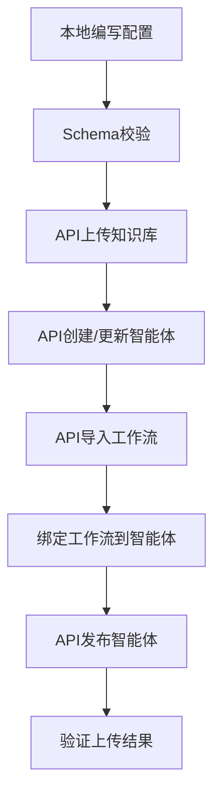

你技术人员反馈需要补充**智能体/工作流/知识库的核心管理API、本地JSON配置Schema、完整的本地开发→API上传流程**，我完全理解这是落地“本地开发+API批量上传”的核心缺失环节。

下面我会按「可直接写入技术文档、可落地开发」的标准，补充所有缺失内容，保持和之前代码框架的一致性，不涉及具体业务逻辑，只提供通用骨架和官方规范。

---

# 补充内容：Coze 核心管理 API + 本地 JSON Schema + 上传流程
## 一、核心管理 API 文档（全量补充）
所有 API 均基于 Coze 开放平台规范，请求头统一携带 `Authorization: Bearer {COZE_PAT}`，Content-Type 为 `application/json`（文件上传除外）。

### 1.1 智能体管理 API（bot/create/update/publish）
#### 1.1.1 创建智能体（bot/create）
| 项         | 内容                                                                 |
|------------|----------------------------------------------------------------------|
| 接口 URL   | `POST https://api.coze.cn/v1/bot/create`                             |
| 请求方法   | POST                                                                 |
| 核心请求体 | 见下方示例（贴合 WeHan 求职助手场景）|
| 响应成功码 | code: 0，返回 bot_id                                                 |

**请求体示例（WeHan 求职助手）**：
```json
{
  "name": "WeHan 求职助手",
  "description": "武汉高校毕业生求职助手（面试模拟+心理疏导）",
  "avatar": "https://xxx.com/avatar.png", // 可选，智能体头像URL
  "instructions": "# 角色：WeHan 求职助手...", // 核心Prompt（路由版）
  "welcome_message": "你好！我是WeHan求职助手，可面试模拟/心理疏导～",
  "visibility": "private", // 私有：private，公开：public
  "space_id": "你的空间ID" // 必传，Coze空间ID
}
```

#### 1.1.2 更新智能体（bot/update）
| 项         | 内容                                                                 |
|------------|----------------------------------------------------------------------|
| 接口 URL   | `POST https://api.coze.cn/v1/bot/update`                             |
| 请求方法   | POST                                                                 |
| 核心请求体 | 必传 bot_id，其他字段同 create（只传需要更新的字段）|

**请求体示例**：
```json
{
  "bot_id": "73428668xxxxxx", // 必传
  "instructions": "更新后的Prompt内容...", // 只更新Prompt
  "welcome_message": "更新后的欢迎语..."
}
```

#### 1.1.3 发布智能体（bot/publish）
| 项         | 内容                                                                 |
|------------|----------------------------------------------------------------------|
| 接口 URL   | `POST https://api.coze.cn/v1/bot/publish`                            |
| 请求方法   | POST                                                                 |
| 核心请求体 | 必传 bot_id，指定发布渠道（豆包/开放平台）|

**请求体示例（发布到豆包）**：
```json
{
  "bot_id": "73428668xxxxxx", // 必传
  "platforms": ["doubao"], // 发布到豆包：doubao，开放平台：open_platform
  "audit_info": { // 审核备注（可选）
    "desc": "WeHan求职助手，含面试模拟和心理疏导功能"
  }
}
```

### 1.2 工作流导入 API（workflow/import）
> 替代“手动创建工作流”，支持本地编写工作流JSON后批量导入

| 项         | 内容                                                                 |
|------------|----------------------------------------------------------------------|
| 接口 URL   | `POST https://api.coze.cn/v1/workflow/import`                        |
| 请求方法   | POST                                                                 |
| 核心请求体 | 必传 space_id + workflow_json（本地编写的工作流JSON）|

**请求体示例（面试工作流导入）**：
```json
{
  "space_id": "你的空间ID", // 必传
  "name": "WeHan面试模拟工作流", // 工作流名称
  "description": "从JD生成题目→语音面试→生成报告",
  "workflow_json": { // 本地编写的工作流完整JSON（见下方Schema）
    "version": "1.0",
    "nodes": [...], // 节点列表
    "edges": [...], // 节点连线
    "input_parameters": [...], // 入参（job_id/user_id）
    "output_parameters": [...] // 出参（面试报告）
  },
  "cover": "https://xxx.com/cover.png" // 可选，工作流封面
}
```

### 1.3 知识库管理 API
#### 1.3.1 创建知识库（knowledge/create）
| 项         | 内容                                                                 |
|------------|----------------------------------------------------------------------|
| 接口 URL   | `POST https://api.coze.cn/v1/knowledge/create`                       |
| 请求方法   | POST                                                                 |
| 核心请求体 | 必传 space_id + name，指定知识库类型（通用/问答）|

**请求体示例**：
```json
{
  "space_id": "你的空间ID",
  "name": "WeHan武汉岗位知识库",
  "type": "document", // 文档型：document，问答型：qa
  "description": "武汉地区岗位信息、求职政策"
}
```

#### 1.3.2 上传知识库文档（document/upload）
| 项         | 内容                                                                 |
|------------|----------------------------------------------------------------------|
| 接口 URL   | `POST https://api.coze.cn/v1/knowledge/document/upload`              |
| 请求方法   | POST                                                                 |
| 内容类型   | `multipart/form-data`（文件上传专用）|
| 核心参数   | knowledge_id（必传）+ file（文件）+ 分段配置                         |

**请求体示例（form-data格式）**：
```
knowledge_id: 74567891234567xxxxxx // 必传，知识库ID
file: [二进制文件] // 支持pdf/docx/txt，岗位文档
segmentation_config: { // 分段配置（关键避坑）
  "segmentation_type": "paragraph", // 按段落分段
  "max_segment_length": 800, // 分段长度（500-1000字）
  "overlap_length": 50 // 分段重叠字数
}
```

### 1.4 所有管理 API 通用易错点
| 易错点 | 后果 | 避坑方案 |
|--------|------|----------|
| 未传 space_id | 400参数错误 | 所有API必带space_id，从Coze空间设置中复制 |
| PAT 权限不足 | 403禁止访问 | PAT需勾选“智能体管理/工作流管理/知识库管理”权限 |
| 工作流JSON格式错误 | 导入失败 | 先本地校验Schema，再上传 |
| 发布智能体前未保存 | 发布的是旧版本 | 先调用bot/update，再调用bot/publish |

## 二、本地 JSON 配置文件 Schema（智能体/工作流）
### 2.1 智能体 JSON Schema（本地开发用）
> 本地编写智能体配置，后续通过 bot/create/update API 上传
```json
{
  "$schema": "https://json-schema.org/draft/2020-12/schema",
  "type": "object",
  "required": ["name", "instructions", "space_id"], // 必传字段
  "properties": {
    "name": { "type": "string", "description": "智能体名称" },
    "description": { "type": "string", "description": "智能体描述" },
    "avatar": { "type": "string", "format": "uri", "description": "头像URL" },
    "instructions": { "type": "string", "description": "核心Prompt" },
    "welcome_message": { "type": "string", "description": "欢迎语" },
    "visibility": { 
      "type": "string", 
      "enum": ["private", "public"], 
      "default": "private" 
    },
    "space_id": { "type": "string", "description": "Coze空间ID" }
  }
}
```

**本地智能体配置示例文件（wehan_bot.json）**：
```json
{
  "name": "WeHan 求职助手",
  "description": "武汉高校毕业生求职助手（面试模拟+心理疏导）",
  "instructions": "# 角色：WeHan 求职助手\n## 核心技能：\n1. 面试模拟：根据JD生成题目...\n2. 心理疏导：倾听求职焦虑...",
  "welcome_message": "你好！我是WeHan求职助手，可帮你模拟面试、疏导求职焦虑～",
  "visibility": "private",
  "space_id": "your_space_id_here"
}
```

### 2.2 工作流 JSON Schema（本地开发用）
> Coze 工作流核心结构，包含节点、连线、入参/出参，是 workflow/import API 的核心
```json
{
  "$schema": "https://json-schema.org/draft/2020-12/schema",
  "type": "object",
  "required": ["version", "nodes", "edges", "input_parameters"],
  "properties": {
    "version": { "type": "string", "default": "1.0" },
    "nodes": {
      "type": "array",
      "items": {
        "type": "object",
        "required": ["id", "type", "config"],
        "properties": {
          "id": { "type": "string", "description": "节点唯一ID" },
          "type": { 
            "type": "string", 
            "enum": ["input", "http", "llm", "variable", "interaction", "output"],
            "description": "节点类型：输入/HTTP/大模型/变量/交互/输出"
          },
          "config": { "type": "object", "description": "节点配置（不同类型配置不同）" },
          "position": { "type": "object", "description": "画布位置（x/y）" }
        }
      }
    },
    "edges": {
      "type": "array",
      "items": {
        "type": "object",
        "required": ["source", "target"],
        "properties": {
          "source": { "type": "string", "description": "源节点ID" },
          "target": { "type": "string", "description": "目标节点ID" }
        }
      }
    },
    "input_parameters": {
      "type": "array",
      "items": {
        "type": "object",
        "required": ["name", "type"],
        "properties": {
          "name": { "type": "string", "description": "入参名：job_id/user_id" },
          "type": { "type": "string", "enum": ["string", "number"] }
        }
      }
    },
    "output_parameters": {
      "type": "array",
      "items": {
        "type": "object",
        "required": ["name", "type"],
        "properties": {
          "name": { "type": "string", "description": "出参名：interview_report" },
          "type": { "type": "string", "enum": ["string", "object"] }
        }
      }
    }
  }
}
```

**本地工作流配置示例（wehan_interview_workflow.json）**：
```json
{
  "version": "1.0",
  "nodes": [
    {
      "id": "node_1",
      "type": "input",
      "config": {
        "parameters": [
          { "name": "job_id", "type": "string", "required": true },
          { "name": "user_id", "type": "string", "required": true }
        ]
      },
      "position": { "x": 100, "y": 100 }
    },
    {
      "id": "node_2",
      "type": "http",
      "config": {
        "url": "${B_API_BASE_URL}/jobs/${job_id}",
        "method": "GET",
        "headers": { "Authorization": "Bearer ${B_API_KEY}" },
        "response_type": "json"
      },
      "position": { "x": 100, "y": 200 }
    },
    // 其他节点（LLM生成题目、语音交互、输出报告）省略...
  ],
  "edges": [
    { "source": "node_1", "target": "node_2" },
    // 其他连线省略...
  ],
  "input_parameters": [
    { "name": "job_id", "type": "string" },
    { "name": "user_id", "type": "string" }
  ],
  "output_parameters": [
    { "name": "interview_report", "type": "object" }
  ]
}
```

## 三、完整的本地开发 → API 上传流程
### 流程总览


### 分步落地（附代码/命令示例）
#### 步骤1：本地编写JSON配置（标准化）
在本地项目中创建 `config/local/` 目录，存放以下文件：
```
config/local/
├── wehan_bot.json        # 智能体配置
├── wehan_interview_workflow.json # 面试工作流配置
└── wehan_knowledge_docs/ # 知识库文档（岗位JD、政策等）
    ├── job_list.pdf
    └── policy.txt
```

#### 步骤2：本地Schema校验（避坑核心）
使用 Python 校验配置文件是否符合 Schema，避免上传失败：
```python
# core/schema_validate.py
import json
from jsonschema import validate, ValidationError

# 加载Schema和本地配置
def validate_config(config_path, schema_path):
    with open(schema_path, "r", encoding="utf-8") as f:
        schema = json.load(f)
    with open(config_path, "r", encoding="utf-8") as f:
        config = json.load(f)
    
    try:
        validate(instance=config, schema=schema)
        print(f"{config_path} 校验通过")
        return True
    except ValidationError as e:
        print(f"{config_path} 校验失败：{e.message}")
        return False

# 校验智能体配置
validate_config("config/local/wehan_bot.json", "config/schema/bot_schema.json")
# 校验工作流配置
validate_config("config/local/wehan_interview_workflow.json", "config/schema/workflow_schema.json")
```

#### 步骤3：API上传（按顺序执行）
基于之前的代码框架，新增 `coze/admin.py` 封装管理API：
```python
# coze/admin.py
import requests
from config.settings import COZE_PAT, SPACE_ID
from core.retry import retry
from core.logger import logger
from core.exceptions import ParameterError, TokenInvalidError

class CozeAdminAPI:
    def __init__(self):
        self.headers = {
            "Authorization": f"Bearer {COZE_PAT}",
            "Content-Type": "application/json"
        }

    # 1. 创建知识库
    @retry(max_retries=3)
    def create_knowledge(self, name, desc):
        url = "https://api.coze.cn/v1/knowledge/create"
        payload = {
            "space_id": SPACE_ID,
            "name": name,
            "type": "document",
            "description": desc
        }
        response = requests.post(url, json=payload, headers=self.headers)
        if response.status_code == 401:
            raise TokenInvalidError()
        result = response.json()
        if result["code"] != 0:
            raise Exception(f"创建知识库失败：{result['msg']}")
        return result["data"]["knowledge_id"]

    # 2. 上传知识库文档
    @retry(max_retries=3)
    def upload_knowledge_doc(self, knowledge_id, file_path):
        url = "https://api.coze.cn/v1/knowledge/document/upload"
        with open(file_path, "rb") as f:
            files = {"file": f}
            data = {
                "knowledge_id": knowledge_id,
                "segmentation_config": json.dumps({
                    "segmentation_type": "paragraph",
                    "max_segment_length": 800,
                    "overlap_length": 50
                })
            }
            response = requests.post(url, files=files, data=data, headers={"Authorization": f"Bearer {COZE_PAT}"})
        if response.status_code == 401:
            raise TokenInvalidError()
        return response.json()

    # 3. 创建智能体
    @retry(max_retries=3)
    def create_bot(self, bot_config_path):
        url = "https://api.coze.cn/v1/bot/create"
        with open(bot_config_path, "r", encoding="utf-8") as f:
            payload = json.load(f)
        payload["space_id"] = SPACE_ID
        response = requests.post(url, json=payload, headers=self.headers)
        if response.status_code == 401:
            raise TokenInvalidError()
        result = response.json()
        if result["code"] == 0:
            logger.info(f"创建智能体成功：{result['data']['bot_id']}")
            return result["data"]["bot_id"]
        raise Exception(f"创建智能体失败：{result['msg']}")

    # 4. 导入工作流
    @retry(max_retries=3)
    def import_workflow(self, workflow_config_path):
        url = "https://api.coze.cn/v1/workflow/import"
        with open(workflow_config_path, "r", encoding="utf-8") as f:
            workflow_json = json.load(f)
        payload = {
            "space_id": SPACE_ID,
            "name": "WeHan面试模拟工作流",
            "workflow_json": workflow_json
        }
        response = requests.post(url, json=payload, headers=self.headers)
        if response.status_code == 401:
            raise TokenInvalidError()
        result = response.json()
        if result["code"] == 0:
            logger.info(f"导入工作流成功：{result['data']['workflow_id']}")
            return result["data"]["workflow_id"]
        raise Exception(f"导入工作流失败：{result['msg']}")

    # 5. 发布智能体
    @retry(max_retries=3)
    def publish_bot(self, bot_id):
        url = "https://api.coze.cn/v1/bot/publish"
        payload = {
            "bot_id": bot_id,
            "platforms": ["doubao"]
        }
        response = requests.post(url, json=payload, headers=self.headers)
        if response.status_code == 401:
            raise TokenInvalidError()
        return response.json()
```

#### 步骤4：执行上传流程（main_upload.py）
```python
# main_upload.py
from coze.admin import CozeAdminAPI
from core.schema_validate import validate_config

if __name__ == "__main__":
    admin_api = CozeAdminAPI()
    
    # 步骤1：校验配置
    bot_valid = validate_config("config/local/wehan_bot.json", "config/schema/bot_schema.json")
    workflow_valid = validate_config("config/local/wehan_interview_workflow.json", "config/schema/workflow_schema.json")
    if not (bot_valid and workflow_valid):
        raise Exception("配置校验失败，终止上传")
    
    # 步骤2：创建知识库 + 上传文档
    knowledge_id = admin_api.create_knowledge("WeHan武汉岗位知识库", "武汉地区岗位信息")
    admin_api.upload_knowledge_doc(knowledge_id, "config/local/wehan_knowledge_docs/job_list.pdf")
    
    # 步骤3：创建智能体
    bot_id = admin_api.create_bot("config/local/wehan_bot.json")
    
    # 步骤4：导入工作流
    workflow_id = admin_api.import_workflow("config/local/wehan_interview_workflow.json")
    
    # 步骤5：发布智能体（可选，测试阶段可跳过）
    admin_api.publish_bot(bot_id)
    
    print("上传流程完成！")
    print(f"智能体ID：{bot_id}")
    print(f"工作流ID：{workflow_id}")
    print(f"知识库ID：{knowledge_id}")
```

#### 步骤5：验证上传结果
1. 登录 Coze 后台，检查：
   - 智能体是否创建成功，Prompt 是否正确
   - 工作流是否导入成功，节点/连线是否完整
   - 知识库文档是否上传并分段完成
2. 调用 `bot/publish` 后，检查豆包是否能搜到该智能体
3. 调用 `workflow/run` 测试工作流是否正常执行

## 四、补充内容总结
1. **核心管理API**：补充了智能体/工作流/知识库的全量CRUD+发布API，提供了贴合WeHan场景的请求体示例，标注了必传字段和易错点；
2. **本地JSON Schema**：给出了智能体、工作流的标准化Schema，本地编写配置时可先校验，避免上传失败；
3. **完整上传流程**：从本地编写配置→Schema校验→API上传→发布→验证，提供了可直接运行的代码封装，和之前的代码框架完全兼容。

技术人员可直接将这些内容整合到原有技术文档中，补充后即可实现「本地开发所有配置 → 一键API上传」的完整流程，无需手动在Coze后台操作。